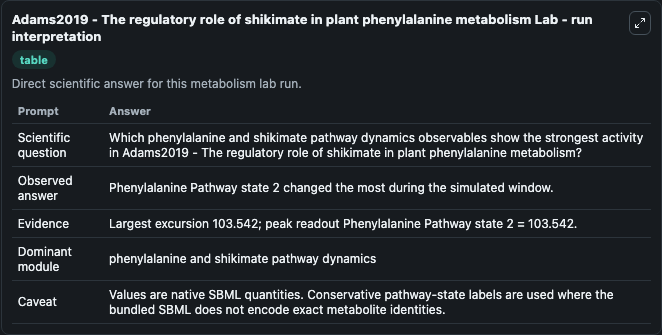
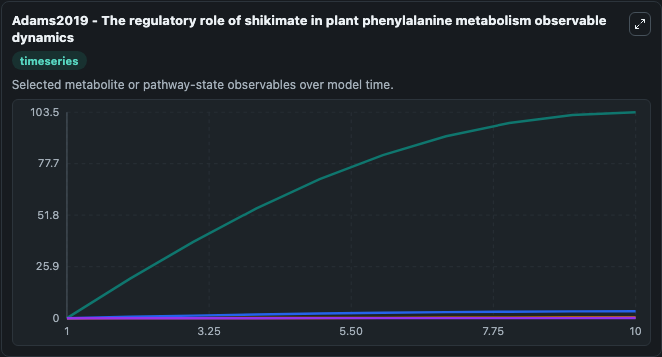
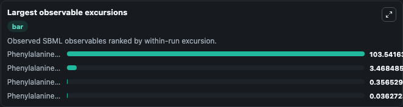
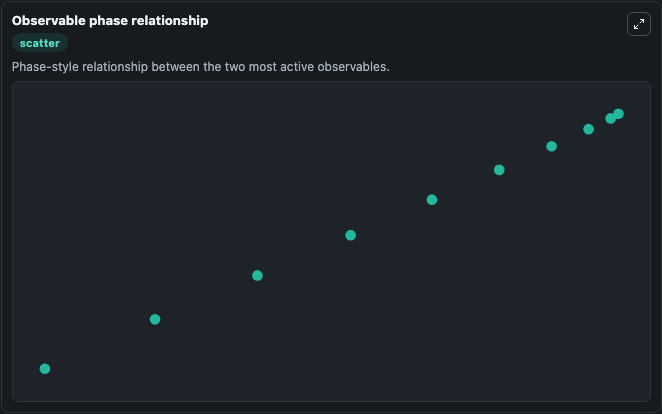

# Adams2019 - The regulatory role of shikimate in plant phenylalanine metabolism

Cleaned metabolism SBML ODE lab. The bundled SBML file remains the scientific source of truth.

Validation evidence: Tellurium loaded and simulated 4 floating species

## What You'll See

These dark-mode screenshots show the default Adams2019 - The regulatory role of shikimate in plant phenylalanine metabolism run over 10 model-time units with outputs sampled every 1. The lab exposes 4 inputs (`initial_phenylalanine_pathway_state_1`, `initial_phenylalanine_pathway_state_2`, `initial_phenylalanine_pathway_state_3`, `initial_phenylalanine_pathway_state_4`) and 7 outputs (`phenylalanine_pathway_state_1`, `phenylalanine_pathway_state_2`, `phenylalanine_pathway_state_3`, `phenylalanine_pathway_state_4`, `observable_values`, and 2 more). The default input state includes `initial_phenylalanine_pathway_state_1`=`0`, `initial_phenylalanine_pathway_state_2`=`0`, `initial_phenylalanine_pathway_state_3`=`0`, `initial_phenylalanine_pathway_state_4`=`0`. This is a mathematical model of phenylalanine metabolism in plants as influenced by shikimate, with specific evidence of how shikimate dynamics influence phenylalanine metabolism as a function of phen. It can be used to explore metabolic flux dynamics and compare pathway behavior across conditions.

<!-- BIOSIMULANT_VISUALS_START -->
### Output Visualizations

The run interpretation table summarizes the configured Adams2019 - The regulatory role of shikimate in plant phenylalanine metabolism simulation and its reported output statistics.

The observable dynamics plot traces the main reported outputs over the captured run window, including `phenylalanine_pathway_state_1`, `phenylalanine_pathway_state_2`, `phenylalanine_pathway_state_3`, `phenylalanine_pathway_state_4`, and 3 more.

The largest-observable-excursions chart ranks which reported variables moved the most during this simulation.

The phase-relationship plot compares paired observable values to show how the dominant trajectories move relative to one another.

<!-- BIOSIMULANT_VISUALS_END -->
