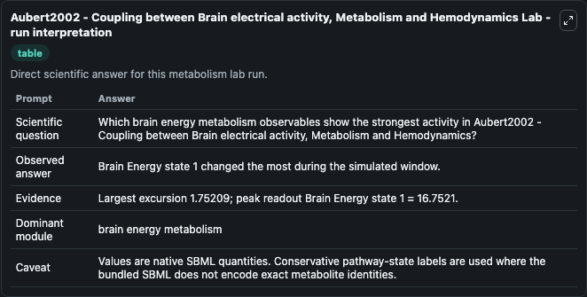
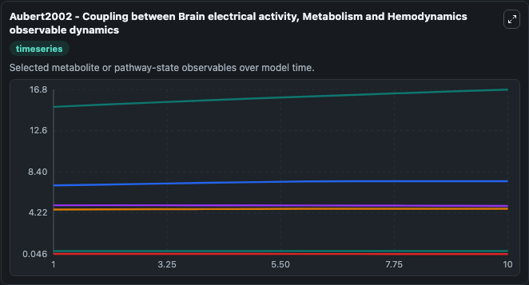
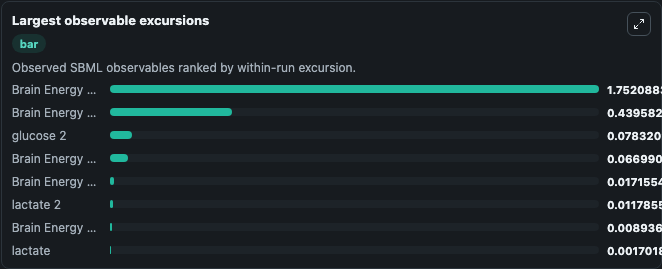
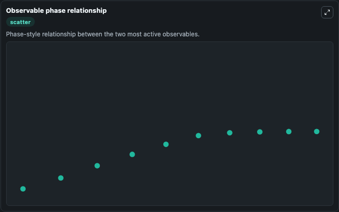

# Aubert2002 - Coupling between Brain electrical activity, Metabolism and Hemodynamics

Cleaned metabolism SBML ODE lab. The bundled SBML file remains the scientific source of truth.

Validation evidence: Tellurium loaded and simulated 13 floating species

## What You'll See

These dark-mode screenshots show the default Aubert2002 - Coupling between Brain electrical activity, Metabolism and Hemodynamics run over 10 model-time units with outputs sampled every 1. The lab exposes 5 inputs (`initial_brain_energy_state_1`, `initial_glucose`, `initial_glyceraldehyde_3_phosphate`, `initial_nadh`, `initial_pyruvate`) and 8 outputs (`brain_energy_state_1`, `glucose`, `glyceraldehyde_3_phosphate`, `nadh`, `pyruvate`, and 3 more). The default input state includes `initial_brain_energy_state_1`=`15`, `initial_glucose`=`1.2`, `initial_glyceraldehyde_3_phosphate`=`0.0057`, `initial_nadh`=`0.026`. Aubert2002 - Coupling between Brainelectrical activity, Metabolism and Hemodynamics Felix Winter encoded this model in SBMLas part of his work at ASD GmbH This model is described in the article: A mod. It can be used to explore metabolic flux dynamics and compare pathway behavior across conditions.

<!-- BIOSIMULANT_VISUALS_START -->
### Output Visualizations

The run interpretation table summarizes the configured Aubert2002 - Coupling between Brain electrical activity, Metabolism and Hemodynamics simulation and its reported output statistics.

The observable dynamics plot traces the main reported outputs over the captured run window, including `brain_energy_state_1`, `glucose`, `glyceraldehyde_3_phosphate`, `nadh`, and 4 more.

The largest-observable-excursions chart ranks which reported variables moved the most during this simulation.

The phase-relationship plot compares paired observable values to show how the dominant trajectories move relative to one another.

<!-- BIOSIMULANT_VISUALS_END -->
