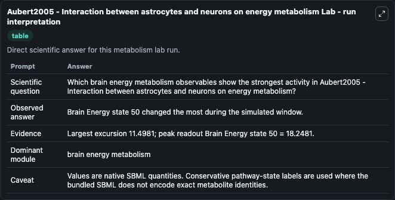
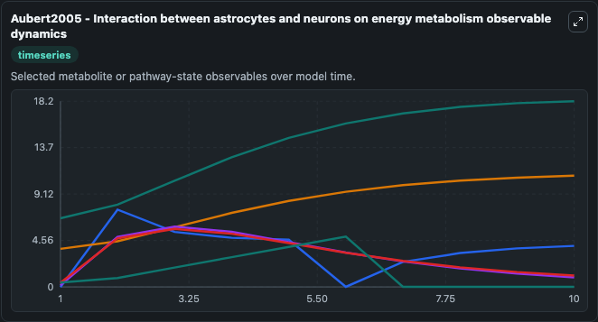
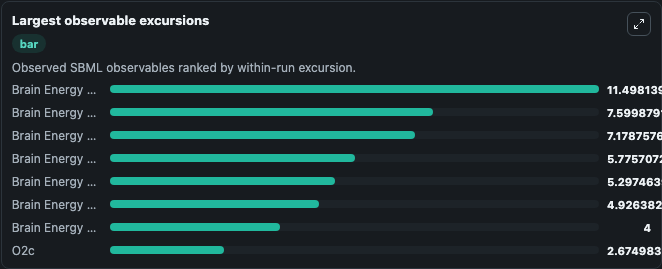
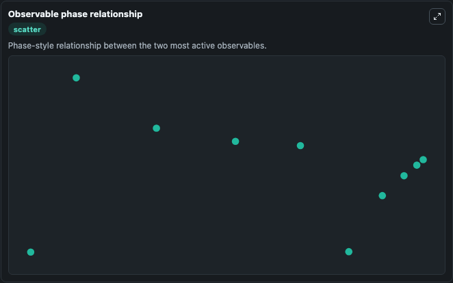

# Aubert2005 - Interaction between astrocytes and neurons on energy metabolism

Cleaned metabolism SBML ODE lab. The bundled SBML file remains the scientific source of truth.

Validation evidence: Tellurium loaded and simulated 20 floating species

## What You'll See

These dark-mode screenshots show the default Aubert2005 - Interaction between astrocytes and neurons on energy metabolism run over 10 model-time units with outputs sampled every 1. The lab exposes 5 inputs (`initial_neuronal_adp`, `initial_neuronal_amp`, `initial_brain_energy_state_3`, `initial_brain_energy_state_4`, `initial_brain_energy_state_5`) and 8 outputs (`neuronal_adp`, `neuronal_amp`, `brain_energy_state_3`, `brain_energy_state_4`, `brain_energy_state_5`, and 3 more). The default input state includes `initial_neuronal_adp`=`0.0119296850858459`, `initial_neuronal_amp`=`0.0000703149141538795`, `initial_brain_energy_state_3`=`0.0119296850858464`, `initial_brain_energy_state_4`=`0.0000703149141538795`. Aubert2005 - Interaction between astrocytesand neurons on energy metabolism Enocded non-curated model. Issues: - Confusing equations A.41 and A.42 - Missing values for parameters Vv,0 and dHb,0 This m.

<!-- BIOSIMULANT_VISUALS_START -->
### Output Visualizations

The run interpretation table summarizes the configured Aubert2005 - Interaction between astrocytes and neurons on energy metabolism simulation and its reported output statistics.

The observable dynamics plot traces the main reported outputs over the captured run window, including `neuronal_adp`, `neuronal_amp`, `brain_energy_state_3`, `brain_energy_state_4`, and 4 more.

The largest-observable-excursions chart ranks which reported variables moved the most during this simulation.

The phase-relationship plot compares paired observable values to show how the dominant trajectories move relative to one another.

<!-- BIOSIMULANT_VISUALS_END -->
