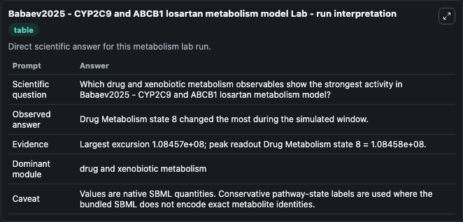
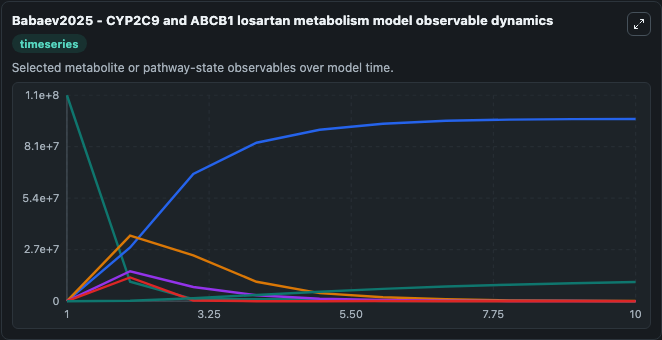
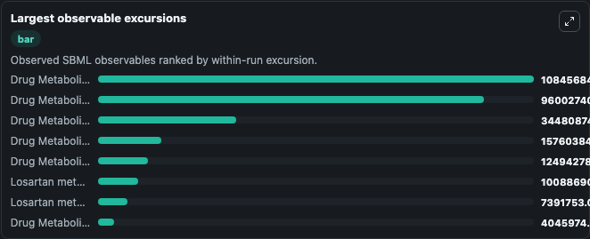
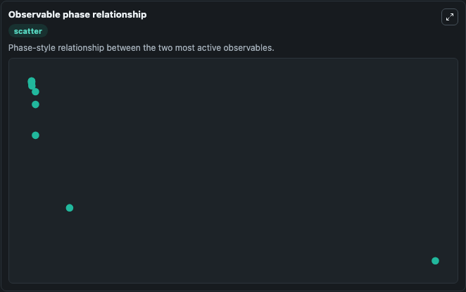

# Babaev2025 - CYP2C9 and ABCB1 losartan metabolism model

Cleaned metabolism SBML ODE lab. The bundled SBML file remains the scientific source of truth.

Validation evidence: Tellurium loaded and simulated 8 floating species

## What You'll See

These dark-mode screenshots show the default Babaev2025 - CYP2C9 and ABCB1 losartan metabolism model run over 10 model-time units with outputs sampled every 1. The lab exposes 5 inputs (`initial_losartan_metabolite_e3174`, `initial_losartan_metabolite_e3174_2`, `initial_drug_metabolism_state_3`, `initial_drug_metabolism_state_4`, `initial_drug_metabolism_state_5`) and 8 outputs (`losartan_metabolite_e3174`, `losartan_metabolite_e3174_2`, `drug_metabolism_state_3`, `drug_metabolism_state_4`, `drug_metabolism_state_5`, and 3 more). The default input state includes `initial_losartan_metabolite_e3174`=`0`, `initial_losartan_metabolite_e3174_2`=`0`, `initial_drug_metabolism_state_3`=`0`, `initial_drug_metabolism_state_4`=`0`. The model can simultaneously predict the profiles of both losartan and its active metabolite, E-3174, based on a given patient's CYP2C9 and ABCB1 genotypes.The CYP2C9 alleles considered are CYP2C9*1 a. It can be used to explore metabolic flux dynamics and compare pathway behavior across conditions.

<!-- BIOSIMULANT_VISUALS_START -->
### Output Visualizations

The run interpretation table summarizes the configured Babaev2025 - CYP2C9 and ABCB1 losartan metabolism model simulation and its reported output statistics.

The observable dynamics plot traces the main reported outputs over the captured run window, including `losartan_metabolite_e3174`, `losartan_metabolite_e3174_2`, `drug_metabolism_state_3`, `drug_metabolism_state_4`, and 4 more.

The largest-observable-excursions chart ranks which reported variables moved the most during this simulation.

The phase-relationship plot compares paired observable values to show how the dominant trajectories move relative to one another.

<!-- BIOSIMULANT_VISUALS_END -->
