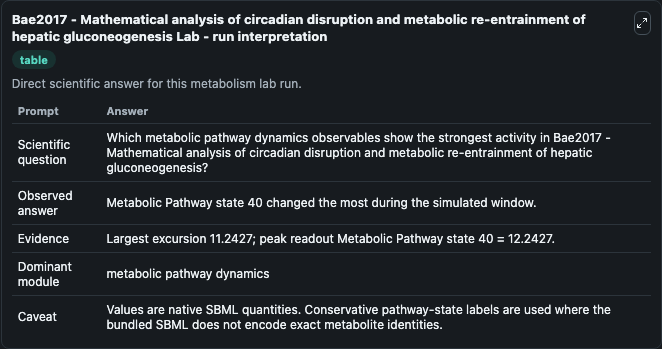
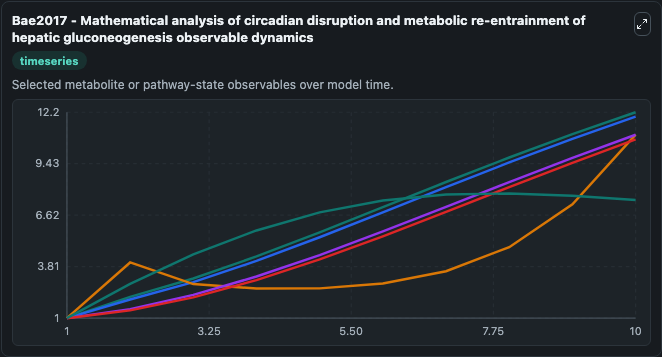
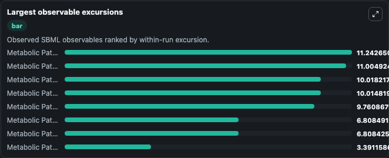
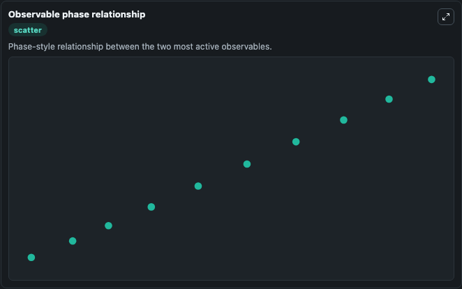

# Bae2017 - Mathematical analysis of circadian disruption and metabolic re-entrainment of hepatic gluconeogenesis

Cleaned metabolism SBML ODE lab. The bundled SBML file remains the scientific source of truth.

Validation evidence: Tellurium loaded and simulated 41 floating species

## What You'll See

These dark-mode screenshots show the default Bae2017 - Mathematical analysis of circadian disruption and metabolic re-entrainment of hepatic gluconeogenesis run over 10 model-time units with outputs sampled every 1. The lab exposes 5 inputs (`initial_crh`, `initial_acth`, `initial_metabolic_pathway_state_3`, `initial_metabolic_pathway_state_4_cytosolic`, `initial_metabolic_pathway_state_5`) and 8 outputs (`crh`, `acth`, `metabolic_pathway_state_3`, `metabolic_pathway_state_4_cytosolic`, `metabolic_pathway_state_5`, and 3 more). The default input state includes `initial_crh`=`1`, `initial_acth`=`1`, `initial_metabolic_pathway_state_3`=`1`, `initial_metabolic_pathway_state_4_cytosolic`=`1`. The circadian rhythms influence the metabolic activity from molecular level to tissue, organ, and host level. Disruption of the circadian rhythms manifests to the host's health as metabolic syndromes,.

<!-- BIOSIMULANT_VISUALS_START -->
### Output Visualizations

The run interpretation table summarizes the configured Bae2017 - Mathematical analysis of circadian disruption and metabolic re-entrainment of hepatic gluconeogenesis simulation and its reported output statistics.

The observable dynamics plot traces the main reported outputs over the captured run window, including `crh`, `acth`, `metabolic_pathway_state_3`, `metabolic_pathway_state_4_cytosolic`, and 4 more.

The largest-observable-excursions chart ranks which reported variables moved the most during this simulation.

The phase-relationship plot compares paired observable values to show how the dominant trajectories move relative to one another.

<!-- BIOSIMULANT_VISUALS_END -->
