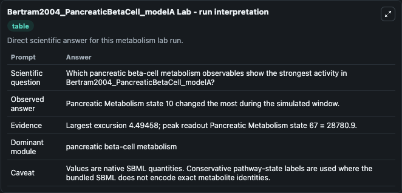
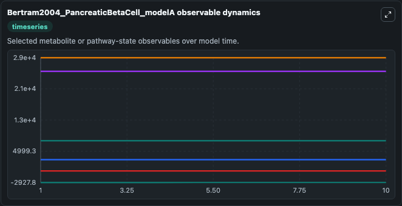
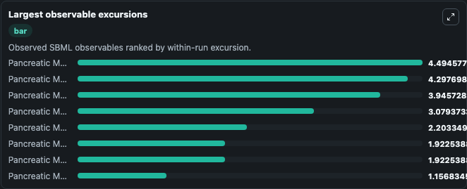
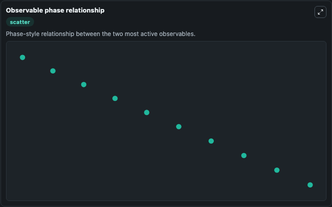

# Bertram2004_PancreaticBetaCell_modelA

Cleaned metabolism SBML ODE lab. The bundled SBML file remains the scientific source of truth.

Validation evidence: Tellurium loaded and simulated 20 floating species

## What You'll See

These dark-mode screenshots show the default Bertram2004_PancreaticBetaCell_modelA run over 10 model-time units with outputs sampled every 1. The lab exposes 5 inputs (`initial_pancreatic_metabolism_state_1`, `initial_pancreatic_metabolism_state_2`, `initial_pancreatic_metabolism_state_3`, `initial_pancreatic_metabolism_state_4`, `initial_fructose_bisphosphate`) and 8 outputs (`pancreatic_metabolism_state_1`, `pancreatic_metabolism_state_2`, `pancreatic_metabolism_state_3`, `pancreatic_metabolism_state_4`, `fructose_bisphosphate`, and 3 more). The default input state includes `initial_pancreatic_metabolism_state_1`=`-60`, `initial_pancreatic_metabolism_state_2`=`0`, `initial_pancreatic_metabolism_state_3`=`0.1`, `initial_pancreatic_metabolism_state_4`=`185`. This a model from the article: Calcium and glycolysis mediate multiple bursting modes in pancreatic islets. Bertram R, Satin L, Zhang M, Smolen P, Sherman A.

<!-- BIOSIMULANT_VISUALS_START -->
### Output Visualizations

The run interpretation table summarizes the configured Bertram2004_PancreaticBetaCell_modelA simulation and its reported output statistics.

The observable dynamics plot traces the main reported outputs over the captured run window, including `pancreatic_metabolism_state_1`, `pancreatic_metabolism_state_2`, `pancreatic_metabolism_state_3`, `pancreatic_metabolism_state_4`, and 4 more.

The largest-observable-excursions chart ranks which reported variables moved the most during this simulation.

The phase-relationship plot compares paired observable values to show how the dominant trajectories move relative to one another.

<!-- BIOSIMULANT_VISUALS_END -->
