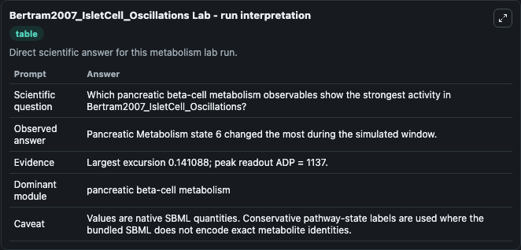
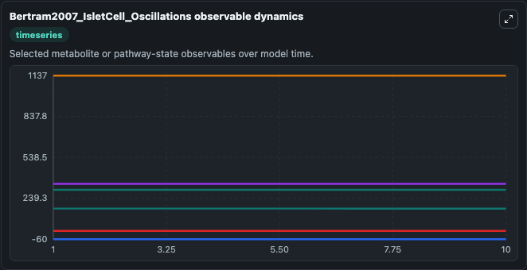
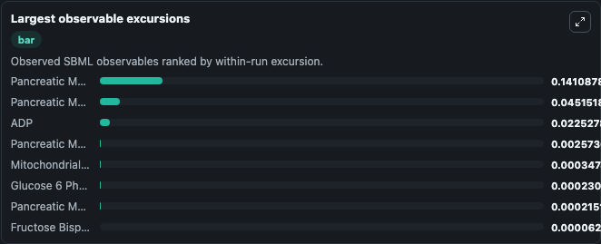
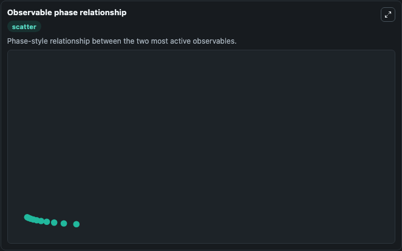

# Bertram2007_IsletCell_Oscillations

Cleaned metabolism SBML ODE lab. The bundled SBML file remains the scientific source of truth.

Validation evidence: Tellurium loaded and simulated 11 floating species

## What You'll See

These dark-mode screenshots show the default Bertram2007_IsletCell_Oscillations run over 10 model-time units with outputs sampled every 1. The lab exposes 5 inputs (`initial_pancreatic_metabolism_state_1`, `initial_pancreatic_metabolism_state_2`, `initial_glucose_6_phosphate`, `initial_fructose_bisphosphate`, `initial_mitochondrial_nadh`) and 8 outputs (`pancreatic_metabolism_state_1`, `pancreatic_metabolism_state_2`, `glucose_6_phosphate`, `fructose_bisphosphate`, `mitochondrial_nadh`, and 3 more). The default input state includes `initial_pancreatic_metabolism_state_1`=`-60`, `initial_pancreatic_metabolism_state_2`=`0`, `initial_glucose_6_phosphate`=`301`, `initial_fructose_bisphosphate`=`2.16`. This is the model described in the article: Interaction of glycolysis and mitochondrial respiration in metabolic oscillations of pancreatic islets. Bertram R, Satin LS, Pedersen MG, Luciani DS, Sherma.

<!-- BIOSIMULANT_VISUALS_START -->
### Output Visualizations

The run interpretation table summarizes the configured Bertram2007_IsletCell_Oscillations simulation and its reported output statistics.

The observable dynamics plot traces the main reported outputs over the captured run window, including `pancreatic_metabolism_state_1`, `pancreatic_metabolism_state_2`, `glucose_6_phosphate`, `fructose_bisphosphate`, and 4 more.

The largest-observable-excursions chart ranks which reported variables moved the most during this simulation.

The phase-relationship plot compares paired observable values to show how the dominant trajectories move relative to one another.

<!-- BIOSIMULANT_VISUALS_END -->
