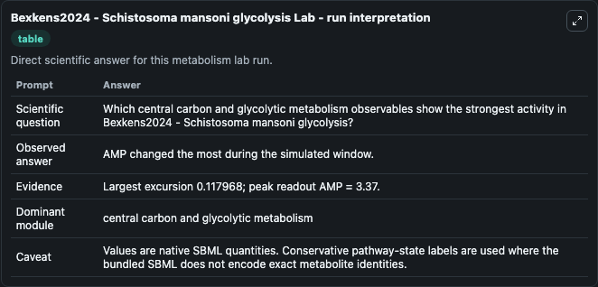
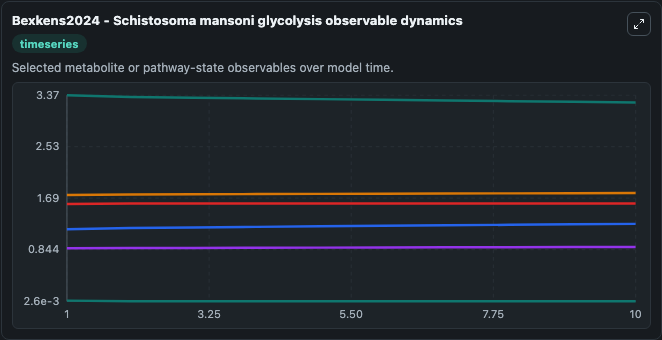
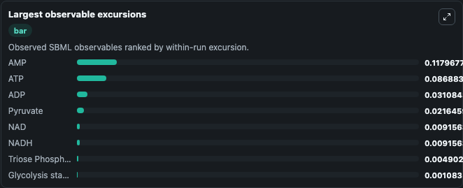
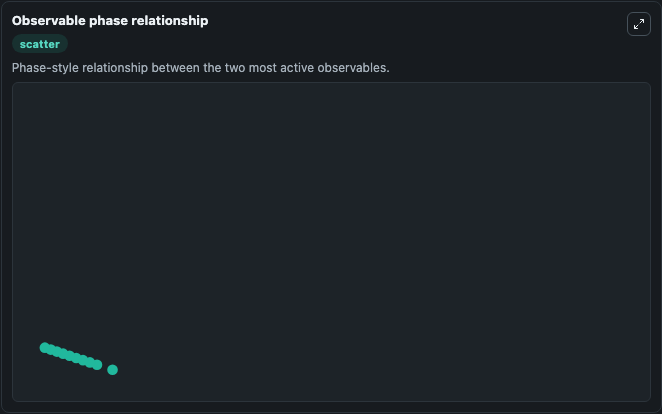

# Bexkens2024 - Schistosoma mansoni glycolysis

Cleaned metabolism SBML ODE lab. The bundled SBML file remains the scientific source of truth.

Validation evidence: Tellurium loaded and simulated 15 floating species

## What You'll See

These dark-mode screenshots show the default Bexkens2024 - Schistosoma mansoni glycolysis run over 10 model-time units with outputs sampled every 1. The lab exposes 5 inputs (`initial_atp`, `initial_intracellular_glucose`, `initial_adp`, `initial_glucose_6_phosphate`, `initial_fructose_6_phosphate`) and 8 outputs (`atp`, `intracellular_glucose`, `adp`, `glucose_6_phosphate`, `fructose_6_phosphate`, and 3 more). The default input state includes `initial_atp`=`1.18`, `initial_intracellular_glucose`=`0`, `initial_adp`=`1.74`, `initial_glucose_6_phosphate`=`0.00384`. A kinetic model of S. mansoni glycolysis in which we can vary the allosteric regulation on lactate dehydrogenase (LDH).

<!-- BIOSIMULANT_VISUALS_START -->
### Output Visualizations

The run interpretation table summarizes the configured Bexkens2024 - Schistosoma mansoni glycolysis simulation and its reported output statistics.

The observable dynamics plot traces the main reported outputs over the captured run window, including `atp`, `intracellular_glucose`, `adp`, `glucose_6_phosphate`, and 4 more.

The largest-observable-excursions chart ranks which reported variables moved the most during this simulation.

The phase-relationship plot compares paired observable values to show how the dominant trajectories move relative to one another.

<!-- BIOSIMULANT_VISUALS_END -->
