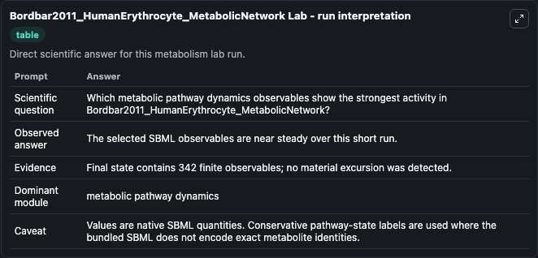
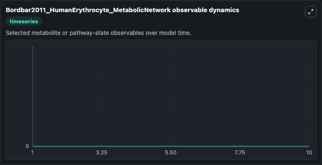
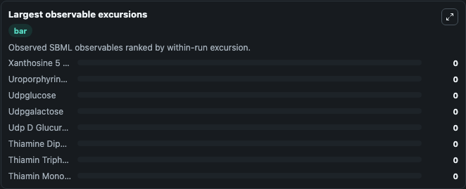

# Bordbar2011_HumanErythrocyte_MetabolicNetwork

Cleaned metabolism SBML ODE lab. The bundled SBML file remains the scientific source of truth.

Validation evidence: Tellurium loaded and simulated 342 floating species

## What You'll See

These dark-mode screenshots show the default Bordbar2011_HumanErythrocyte_MetabolicNetwork run over 10 model-time units with outputs sampled every 1. The lab exposes 5 inputs (`initial_observable_3_phospho_d_glyceroyl_phosphate`, `initial_observable_2_3_disphospho_d_glycerate`, `initial_observable_2_keto_4_methylthiobutyrate`, `initial_d_glycerate_2_phosphate`, `initial_observable_3_5_cyclic_gmp`) and 8 outputs (`observable_3_phospho_d_glyceroyl_phosphate`, `observable_2_3_disphospho_d_glycerate`, `observable_2_keto_4_methylthiobutyrate`, `d_glycerate_2_phosphate`, `observable_3_5_cyclic_gmp`, and 3 more). The default input state includes `initial_observable_3_phospho_d_glyceroyl_phosphate`=`0`, `initial_observable_2_3_disphospho_d_glycerate`=`0`, `initial_observable_2_keto_4_methylthiobutyrate`=`0`, `initial_d_glycerate_2_phosphate`=`0`. This model is from the article: iAB-RBC-283: A proteomically derived knowledge-base of erythrocyte metabolism that can be used to simulate its physiological and patho-physiological states. It can be used to explore metabolic flux dynamics and compare pathway behavior across conditions.

<!-- BIOSIMULANT_VISUALS_START -->
### Output Visualizations

The run interpretation table summarizes the configured Bordbar2011_HumanErythrocyte_MetabolicNetwork simulation and its reported output statistics.

The observable dynamics plot traces the main reported outputs over the captured run window, including `observable_3_phospho_d_glyceroyl_phosphate`, `observable_2_3_disphospho_d_glycerate`, `observable_2_keto_4_methylthiobutyrate`, `d_glycerate_2_phosphate`, and 4 more.

The largest-observable-excursions chart ranks which reported variables moved the most during this simulation.

The phase-relationship plot compares paired observable values to show how the dominant trajectories move relative to one another.

<!-- BIOSIMULANT_VISUALS_END -->
