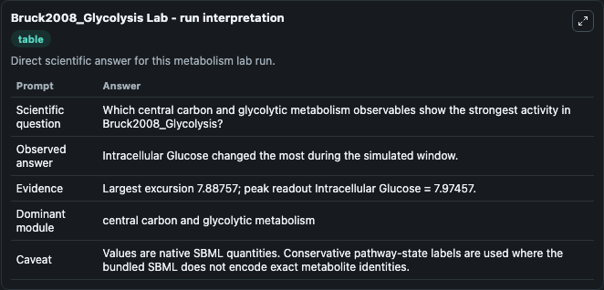
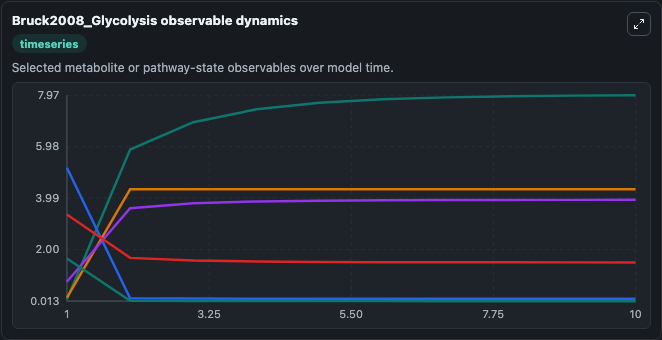
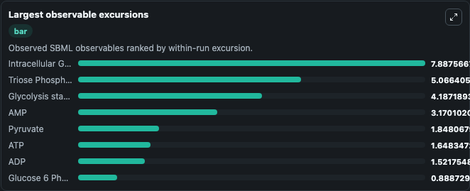
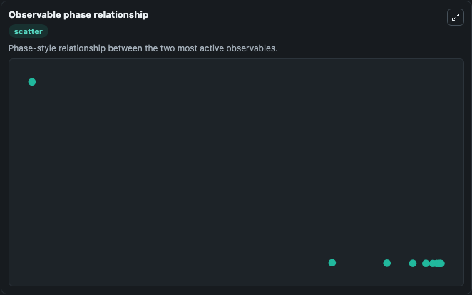

# Bruck2008_Glycolysis

Cleaned metabolism SBML ODE lab. The bundled SBML file remains the scientific source of truth.

Validation evidence: Tellurium loaded and simulated 17 floating species

## What You'll See

These dark-mode screenshots show the default Bruck2008_Glycolysis run over 10 model-time units with outputs sampled every 1. The lab exposes 5 inputs (`initial_intracellular_glucose`, `initial_glucose_6_phosphate`, `initial_fructose_6_phosphate`, `initial_fructose_1_6_bisphosphate`, `initial_triose_phosphate`) and 8 outputs (`intracellular_glucose`, `glucose_6_phosphate`, `fructose_6_phosphate`, `fructose_1_6_bisphosphate`, `triose_phosphate`, and 3 more). The default input state includes `initial_intracellular_glucose`=`0.087`, `initial_glucose_6_phosphate`=`1.39`, `initial_fructose_6_phosphate`=`0.28`, `initial_fructose_1_6_bisphosphate`=`0.1`. Exploring the effect of variable enzyme concentrations in a kinetic model of yeast glycolysis Jozsef Bruck, Wolfram Liebermeister, Edda Klipp, Genome Inform 2008 20:1-14 Abstract: Metabolism is one of. It can be used to explore metabolic flux dynamics and compare pathway behavior across conditions.

<!-- BIOSIMULANT_VISUALS_START -->
### Output Visualizations

The run interpretation table summarizes the configured Bruck2008_Glycolysis simulation and its reported output statistics.

The observable dynamics plot traces the main reported outputs over the captured run window, including `intracellular_glucose`, `glucose_6_phosphate`, `fructose_6_phosphate`, `fructose_1_6_bisphosphate`, and 4 more.

The largest-observable-excursions chart ranks which reported variables moved the most during this simulation.

The phase-relationship plot compares paired observable values to show how the dominant trajectories move relative to one another.

<!-- BIOSIMULANT_VISUALS_END -->
