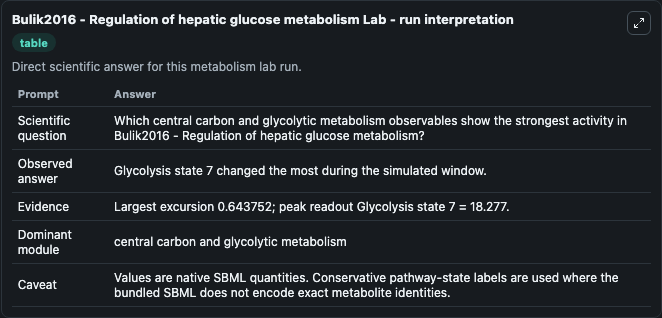
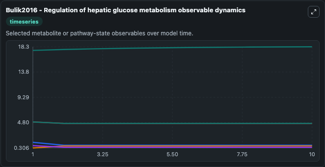
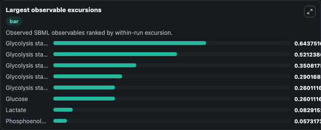
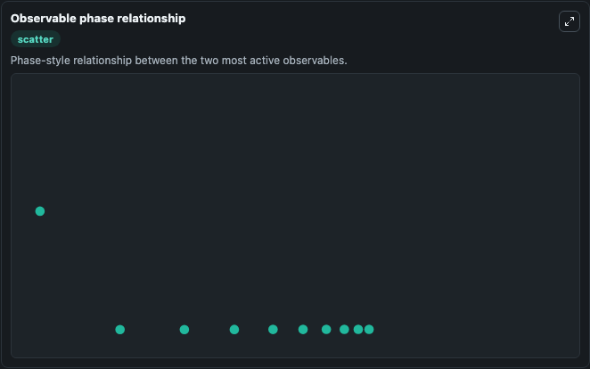

# Bulik2016 - Regulation of hepatic glucose metabolism

Cleaned metabolism SBML ODE lab. The bundled SBML file remains the scientific source of truth.

Validation evidence: Tellurium loaded and simulated 50 floating species

## What You'll See

These dark-mode screenshots show the default Bulik2016 - Regulation of hepatic glucose metabolism run over 10 model-time units with outputs sampled every 1. The lab exposes 5 inputs (`initial_extracellular_glucose`, `initial_extracellular_lactate`, `initial_glucose`, `initial_glycolysis_state_4`, `initial_glycolysis_state_5`) and 8 outputs (`extracellular_glucose`, `extracellular_lactate`, `glucose`, `glycolysis_state_4`, `glycolysis_state_5`, and 3 more). The default input state includes `initial_extracellular_glucose`=`4`, `initial_extracellular_lactate`=`1`, `initial_glucose`=`4.92256221964406`, `initial_glycolysis_state_4`=`0.189929897759633`. Bulik2016 - Regulation of hepatic glucosemetabolism This model is described in the article: The relative importance of kinetic mechanisms and variable enzyme abundances for the regulation of hepatic g. It can be used to explore metabolic flux dynamics and compare pathway behavior across conditions.

<!-- BIOSIMULANT_VISUALS_START -->
### Output Visualizations

The run interpretation table summarizes the configured Bulik2016 - Regulation of hepatic glucose metabolism simulation and its reported output statistics.

The observable dynamics plot traces the main reported outputs over the captured run window, including `extracellular_glucose`, `extracellular_lactate`, `glucose`, `glycolysis_state_4`, and 4 more.

The largest-observable-excursions chart ranks which reported variables moved the most during this simulation.

The phase-relationship plot compares paired observable values to show how the dominant trajectories move relative to one another.

<!-- BIOSIMULANT_VISUALS_END -->
