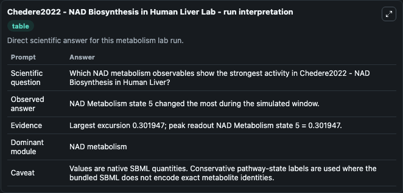
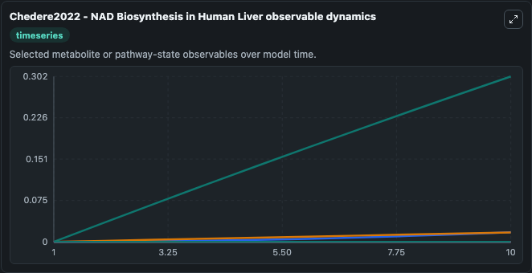
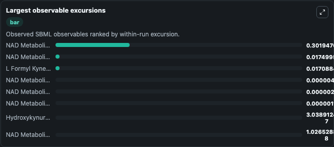
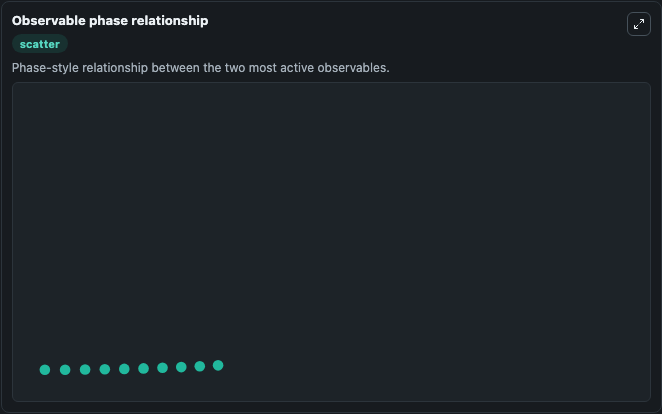

# Chedere2022 - NAD Biosynthesis in Human Liver

Cleaned metabolism SBML ODE lab. The bundled SBML file remains the scientific source of truth.

Validation evidence: Tellurium loaded and simulated 14 floating species

## What You'll See

These dark-mode screenshots show the default Chedere2022 - NAD Biosynthesis in Human Liver run over 10 model-time units with outputs sampled every 1. The lab exposes 5 inputs (`initial_l_formyl_kyneurenine`, `initial_hydroxykynurenine`, `initial_nad_metabolism_state_3`, `initial_nad_metabolism_state_4`, `initial_nad_metabolism_state_5`) and 8 outputs (`l_formyl_kyneurenine`, `hydroxykynurenine`, `nad_metabolism_state_3`, `nad_metabolism_state_4`, `nad_metabolism_state_5`, and 3 more). The default input state includes `initial_l_formyl_kyneurenine`=`0`, `initial_hydroxykynurenine`=`0`, `initial_nad_metabolism_state_3`=`0`, `initial_nad_metabolism_state_4`=`0`. This SBML (L2V4) file is a well-annotated ODE-based model created to capture NAD biosynthesis in the human liver. This model contains 26 reactions with 29 genes, 31 metabolites and 138 parameters.

<!-- BIOSIMULANT_VISUALS_START -->
### Output Visualizations

The run interpretation table summarizes the configured Chedere2022 - NAD Biosynthesis in Human Liver simulation and its reported output statistics.

The observable dynamics plot traces the main reported outputs over the captured run window, including `l_formyl_kyneurenine`, `hydroxykynurenine`, `nad_metabolism_state_3`, `nad_metabolism_state_4`, and 4 more.

The largest-observable-excursions chart ranks which reported variables moved the most during this simulation.

The phase-relationship plot compares paired observable values to show how the dominant trajectories move relative to one another.

<!-- BIOSIMULANT_VISUALS_END -->
