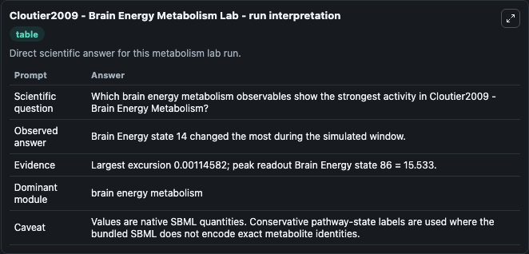
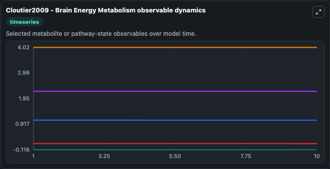
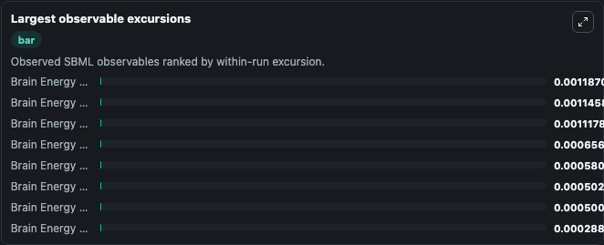
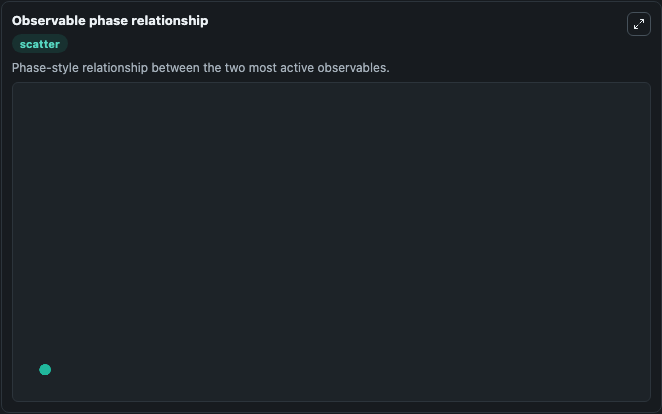

# Cloutier2009 - Brain Energy Metabolism

Cleaned metabolism SBML ODE lab. The bundled SBML file remains the scientific source of truth.

Validation evidence: Tellurium loaded and simulated 20 floating species

## What You'll See

These dark-mode screenshots show the default Cloutier2009 - Brain Energy Metabolism run over 10 model-time units with outputs sampled every 1. The lab exposes 5 inputs (`initial_brain_energy_state_1`, `initial_brain_energy_state_2`, `initial_brain_energy_state_3`, `initial_brain_energy_state_4`, `initial_brain_energy_state_5`) and 8 outputs (`brain_energy_state_1`, `brain_energy_state_2`, `brain_energy_state_3`, `brain_energy_state_4`, `brain_energy_state_5`, and 3 more). The default input state includes `initial_brain_energy_state_1`=`0.00599865999248041`, `initial_brain_energy_state_2`=`0.00600093047858717`, `initial_brain_energy_state_3`=`0.00600284722882977`, `initial_brain_energy_state_4`=`0.1755`. Cloutier2009 - Brain Energy Metabolism This model was taken from the CellMLrepository andautomatically converted to SBML. Following thesubmission the parameters are manually encoded and annotated assp.

<!-- BIOSIMULANT_VISUALS_START -->
### Output Visualizations

The run interpretation table summarizes the configured Cloutier2009 - Brain Energy Metabolism simulation and its reported output statistics.

The observable dynamics plot traces the main reported outputs over the captured run window, including `brain_energy_state_1`, `brain_energy_state_2`, `brain_energy_state_3`, `brain_energy_state_4`, and 4 more.

The largest-observable-excursions chart ranks which reported variables moved the most during this simulation.

The phase-relationship plot compares paired observable values to show how the dominant trajectories move relative to one another.

<!-- BIOSIMULANT_VISUALS_END -->
