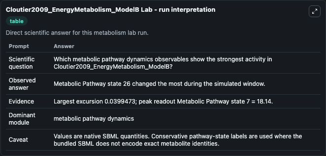
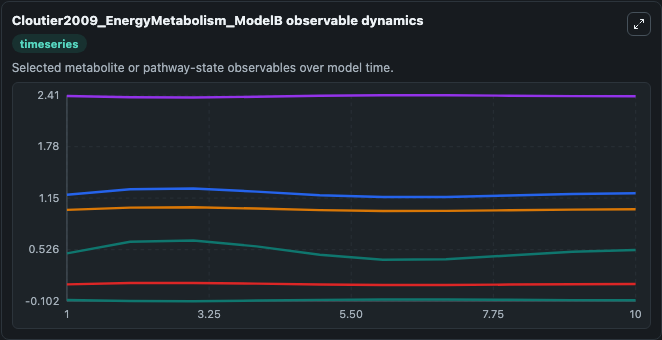
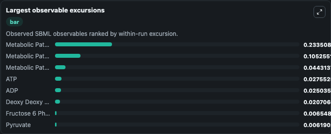
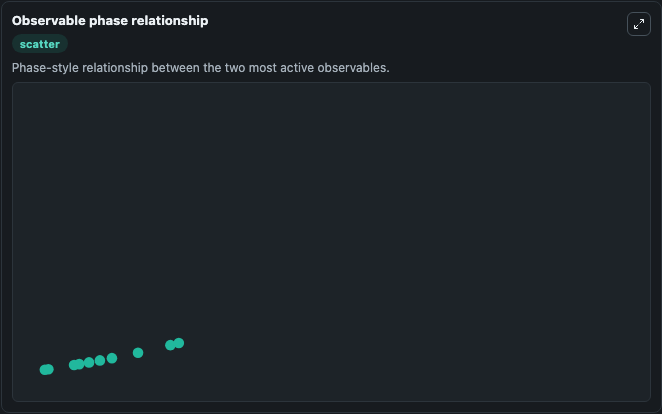

# Cloutier2009_EnergyMetabolism_ModelB

Cleaned metabolism SBML ODE lab. The bundled SBML file remains the scientific source of truth.

Validation evidence: Tellurium loaded and simulated 20 floating species

## What You'll See

These dark-mode screenshots show the default Cloutier2009_EnergyMetabolism_ModelB run over 10 model-time units with outputs sampled every 1. The lab exposes 5 inputs (`initial_fructose_6_phosphate`, `initial_fructose_2_6_bisphosphate`, `initial_glyceraldehyde_3_phosphate`, `initial_pyruvate`, `initial_lactate`) and 8 outputs (`fructose_6_phosphate`, `fructose_2_6_bisphosphate`, `glyceraldehyde_3_phosphate`, `pyruvate`, `lactate`, and 3 more). The default input state includes `initial_fructose_6_phosphate`=`0.2`, `initial_fructose_2_6_bisphosphate`=`0.001`, `initial_glyceraldehyde_3_phosphate`=`0.0405`, `initial_pyruvate`=`0.1`. This a model from the article: The control systems structures of energy metabolism. It can be used to explore metabolic flux dynamics and compare pathway behavior across conditions.

<!-- BIOSIMULANT_VISUALS_START -->
### Output Visualizations

The run interpretation table summarizes the configured Cloutier2009_EnergyMetabolism_ModelB simulation and its reported output statistics.

The observable dynamics plot traces the main reported outputs over the captured run window, including `fructose_6_phosphate`, `fructose_2_6_bisphosphate`, `glyceraldehyde_3_phosphate`, `pyruvate`, and 4 more.

The largest-observable-excursions chart ranks which reported variables moved the most during this simulation.

The phase-relationship plot compares paired observable values to show how the dominant trajectories move relative to one another.

<!-- BIOSIMULANT_VISUALS_END -->
