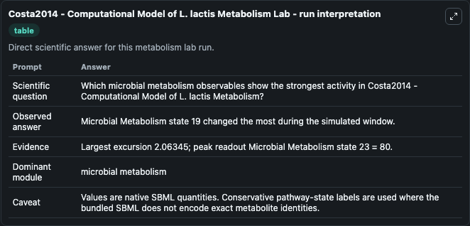
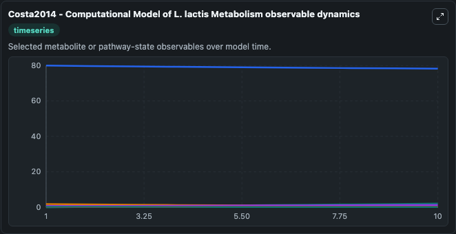
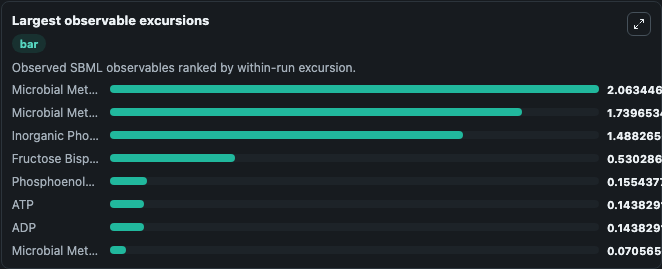
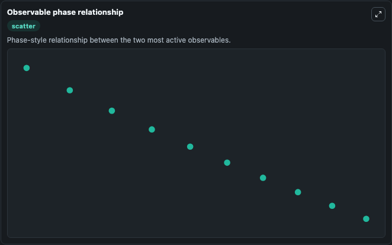

# Costa2014 - Computational Model of L. lactis Metabolism

Cleaned metabolism SBML ODE lab. The bundled SBML file remains the scientific source of truth.

Validation evidence: Tellurium loaded and simulated 26 floating species

## What You'll See

These dark-mode screenshots show the default Costa2014 - Computational Model of L. lactis Metabolism run over 10 model-time units with outputs sampled every 1. The lab exposes 5 inputs (`initial_glucose_6_phosphate`, `initial_atp`, `initial_adp`, `initial_inorganic_phosphate`, `initial_fructose_6_phosphate`) and 8 outputs (`glucose_6_phosphate`, `atp`, `adp`, `inorganic_phosphate`, `fructose_6_phosphate`, and 3 more). The default input state includes `initial_glucose_6_phosphate`=`0`, `initial_atp`=`4.88632508879394`, `initial_adp`=`20.3856905308319`, `initial_inorganic_phosphate`=`38.26`. Costa2014 - Computational Model of L. lactisMetabolism This model is described in the article: An extended dynamic model of Lactococcus lactis metabolism for mannitol and 2,3-butanediol production.

<!-- BIOSIMULANT_VISUALS_START -->
### Output Visualizations

The run interpretation table summarizes the configured Costa2014 - Computational Model of L. lactis Metabolism simulation and its reported output statistics.

The observable dynamics plot traces the main reported outputs over the captured run window, including `glucose_6_phosphate`, `atp`, `adp`, `inorganic_phosphate`, and 4 more.

The largest-observable-excursions chart ranks which reported variables moved the most during this simulation.

The phase-relationship plot compares paired observable values to show how the dominant trajectories move relative to one another.

<!-- BIOSIMULANT_VISUALS_END -->
