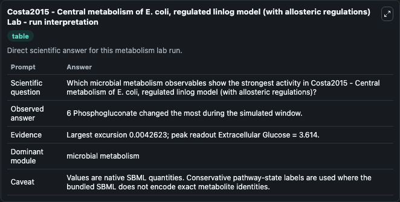
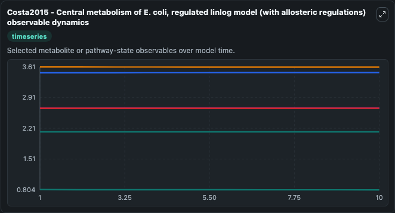
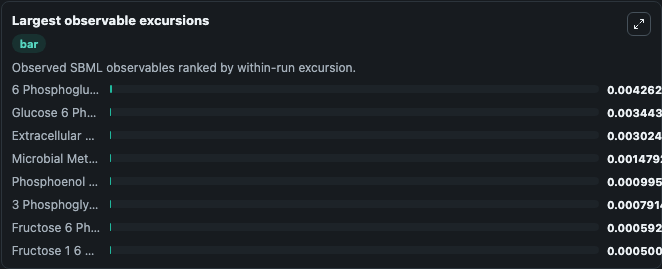
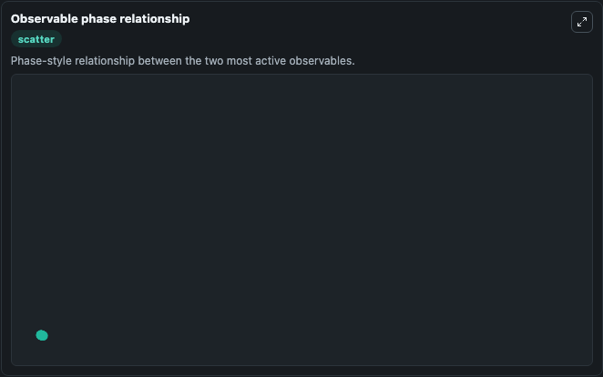

# Costa2015 - Central metabolism of E. coli, regulated linlog model (with allosteric regulations)

Cleaned metabolism SBML ODE lab. The bundled SBML file remains the scientific source of truth.

Validation evidence: Tellurium loaded and simulated 18 floating species

## What You'll See

These dark-mode screenshots show the default Costa2015 - Central metabolism of E. coli, regulated linlog model (with allosteric regulations) run over 10 model-time units with outputs sampled every 1. The lab exposes 5 inputs (`initial_phosphoenol_pyruvate`, `initial_extracellular_glucose`, `initial_glucose_6_phosphate`, `initial_microbial_metabolism_state_4`, `initial_fructose_6_phosphate`) and 8 outputs (`phosphoenol_pyruvate`, `extracellular_glucose`, `glucose_6_phosphate`, `microbial_metabolism_state_4`, `fructose_6_phosphate`, and 3 more). The default input state includes `initial_phosphoenol_pyruvate`=`2.67`, `initial_extracellular_glucose`=`0.0556`, `initial_glucose_6_phosphate`=`3.48`, `initial_microbial_metabolism_state_4`=`2.67`. Metabolism Costa2015Central Metabolism Of EColi Regulated Model1504080004Model represents core biological mechanisms from biomodels_ebi reference biomodels_ebi:MODEL1504080004. When you run it, you can inspect state and compare temporal behavior between baseline and adjusted inputs.

<!-- BIOSIMULANT_VISUALS_START -->
### Output Visualizations

The run interpretation table summarizes the configured Costa2015 - Central metabolism of E. coli, regulated linlog model (with allosteric regulations) simulation and its reported output statistics.

The observable dynamics plot traces the main reported outputs over the captured run window, including `phosphoenol_pyruvate`, `extracellular_glucose`, `glucose_6_phosphate`, `microbial_metabolism_state_4`, and 4 more.

The largest-observable-excursions chart ranks which reported variables moved the most during this simulation.

The phase-relationship plot compares paired observable values to show how the dominant trajectories move relative to one another.

<!-- BIOSIMULANT_VISUALS_END -->
