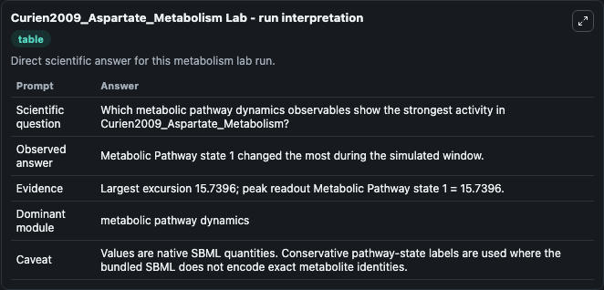
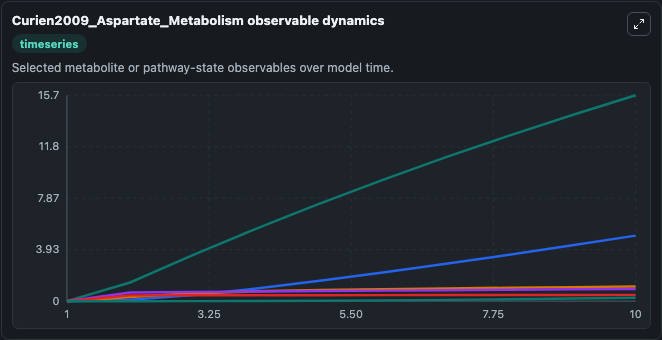
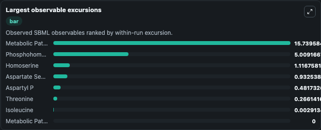
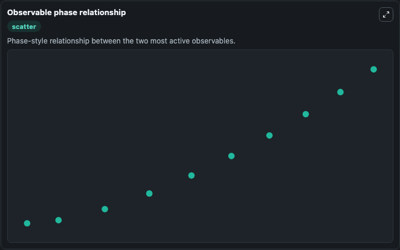

# Curien2009_Aspartate_Metabolism

Cleaned metabolism SBML ODE lab. The bundled SBML file remains the scientific source of truth.

Validation evidence: Tellurium loaded and simulated 8 floating species

## What You'll See

These dark-mode screenshots show the default Curien2009_Aspartate_Metabolism run over 10 model-time units with outputs sampled every 1. The lab exposes 5 inputs (`initial_metabolic_pathway_state_1`, `initial_aspartyl_p`, `initial_threonine`, `initial_aspartate_semialdehyde`, `initial_homoserine`) and 8 outputs (`metabolic_pathway_state_1`, `aspartyl_p`, `threonine`, `aspartate_semialdehyde`, `homoserine`, and 3 more). The default input state includes `initial_metabolic_pathway_state_1`=`0`, `initial_aspartyl_p`=`0`, `initial_threonine`=`0`, `initial_aspartate_semialdehyde`=`0`. This a model described in the article: Understanding the regulation of aspartate metabolism using a model based on measured kinetic parameters. Curien G, Bastien O, Robert-Genthon M, Cornish-Bowden A,.

<!-- BIOSIMULANT_VISUALS_START -->
### Output Visualizations

The run interpretation table summarizes the configured Curien2009_Aspartate_Metabolism simulation and its reported output statistics.

The observable dynamics plot traces the main reported outputs over the captured run window, including `metabolic_pathway_state_1`, `aspartyl_p`, `threonine`, `aspartate_semialdehyde`, and 4 more.

The largest-observable-excursions chart ranks which reported variables moved the most during this simulation.

The phase-relationship plot compares paired observable values to show how the dominant trajectories move relative to one another.

<!-- BIOSIMULANT_VISUALS_END -->
