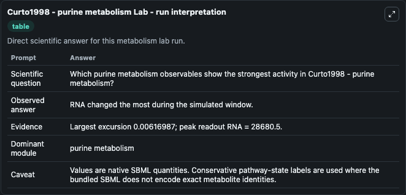
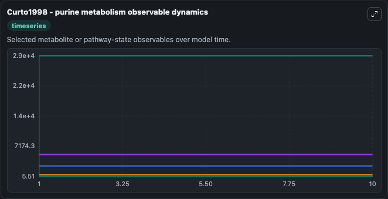
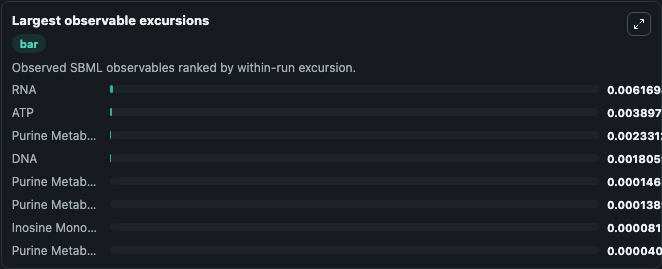
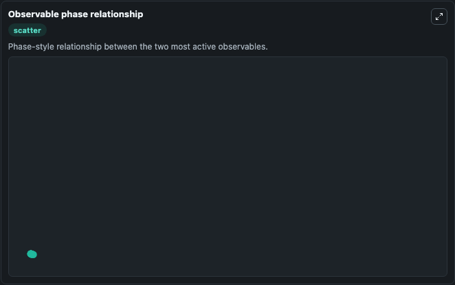

# Curto1998 - purine metabolism

Cleaned metabolism SBML ODE lab. The bundled SBML file remains the scientific source of truth.

Validation evidence: Tellurium loaded and simulated 16 floating species

## What You'll See

These dark-mode screenshots show the default Curto1998 - purine metabolism run over 10 model-time units with outputs sampled every 1. The lab exposes 5 inputs (`initial_phosphoribosylpyrophosphate`, `initial_inosine_monophosphate`, `initial_adenylosuccinate`, `initial_atp`, `initial_s_adenosyl_l_methionine`) and 8 outputs (`phosphoribosylpyrophosphate`, `inosine_monophosphate`, `adenylosuccinate`, `atp`, `s_adenosyl_l_methionine`, and 3 more). The default input state includes `initial_phosphoribosylpyrophosphate`=`5.01742`, `initial_inosine_monophosphate`=`98.2634`, `initial_adenylosuccinate`=`0.198189`, `initial_atp`=`2475.35`. Curto1998 - purine metabolism This is a purine metabolism model that is geared toward studies of gout. It can be used to explore metabolic flux dynamics and compare pathway behavior across conditions.

<!-- BIOSIMULANT_VISUALS_START -->
### Output Visualizations

The run interpretation table summarizes the configured Curto1998 - purine metabolism simulation and its reported output statistics.

The observable dynamics plot traces the main reported outputs over the captured run window, including `phosphoribosylpyrophosphate`, `inosine_monophosphate`, `adenylosuccinate`, `atp`, and 4 more.

The largest-observable-excursions chart ranks which reported variables moved the most during this simulation.

The phase-relationship plot compares paired observable values to show how the dominant trajectories move relative to one another.

<!-- BIOSIMULANT_VISUALS_END -->
