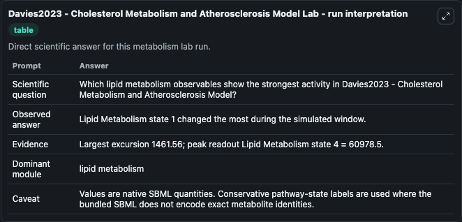
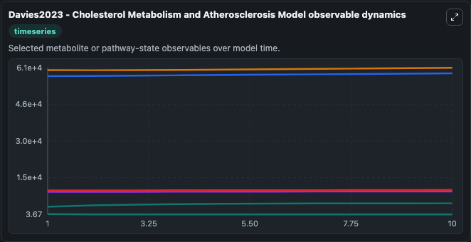
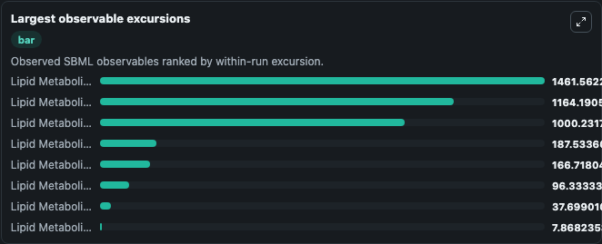
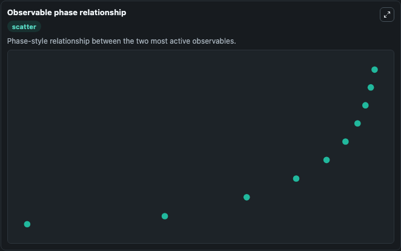

# Davies2023 - Cholesterol Metabolism and Atherosclerosis Model

Cleaned metabolism SBML ODE lab. The bundled SBML file remains the scientific source of truth.

Validation evidence: Tellurium loaded and simulated 29 floating species

## What You'll See

These dark-mode screenshots show the default Davies2023 - Cholesterol Metabolism and Atherosclerosis Model run over 10 model-time units with outputs sampled every 1. The lab exposes 5 inputs (`initial_lipid_metabolism_state_1`, `initial_lipid_metabolism_state_2`, `initial_lipid_metabolism_state_3`, `initial_lipid_metabolism_state_4`, `initial_lipid_metabolism_state_5`) and 8 outputs (`lipid_metabolism_state_1`, `lipid_metabolism_state_2`, `lipid_metabolism_state_3`, `lipid_metabolism_state_4`, `lipid_metabolism_state_5`, and 3 more). The default input state includes `initial_lipid_metabolism_state_1`=`3150`, `initial_lipid_metabolism_state_2`=`400`, `initial_lipid_metabolism_state_3`=`467`, `initial_lipid_metabolism_state_4`=`60000`. Merged model of whole body cholesterol metabolism (BIOMD0000000434) and atherosclerosis (MODEL1002160000). It can be used to explore metabolic flux dynamics and compare pathway behavior across conditions.

<!-- BIOSIMULANT_VISUALS_START -->
### Output Visualizations

The run interpretation table summarizes the configured Davies2023 - Cholesterol Metabolism and Atherosclerosis Model simulation and its reported output statistics.

The observable dynamics plot traces the main reported outputs over the captured run window, including `lipid_metabolism_state_1`, `lipid_metabolism_state_2`, `lipid_metabolism_state_3`, `lipid_metabolism_state_4`, and 4 more.

The largest-observable-excursions chart ranks which reported variables moved the most during this simulation.

The phase-relationship plot compares paired observable values to show how the dominant trajectories move relative to one another.

<!-- BIOSIMULANT_VISUALS_END -->
