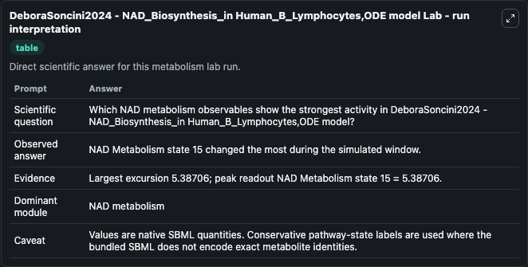
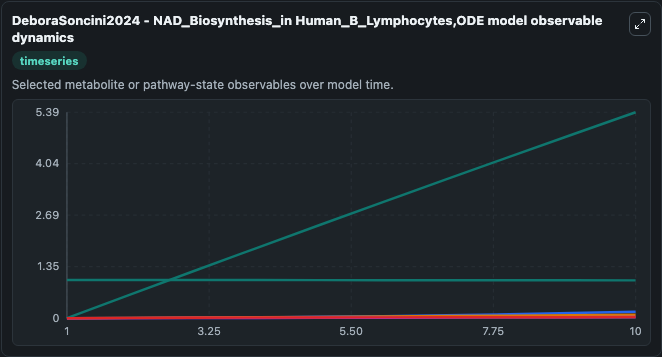
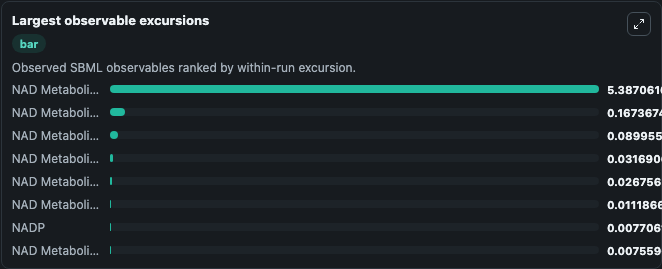
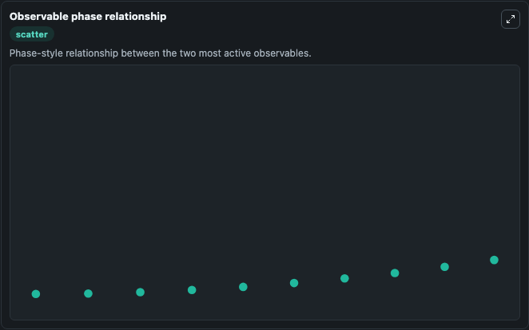

# DeboraSoncini2024 - NAD_Biosynthesis_in Human_B_Lymphocytes,ODE model

Cleaned metabolism SBML ODE lab. The bundled SBML file remains the scientific source of truth.

Validation evidence: Tellurium loaded and simulated 18 floating species

## What You'll See

These dark-mode screenshots show the default DeboraSoncini2024 - NAD_Biosynthesis_in Human_B_Lymphocytes,ODE model run over 10 model-time units with outputs sampled every 1. The lab exposes 5 inputs (`initial_nad_metabolism_state_1`, `initial_nad_metabolism_state_2`, `initial_nad_metabolism_state_3`, `initial_nad_metabolism_state_4`, `initial_nad_metabolism_state_5`) and 8 outputs (`nad_metabolism_state_1`, `nad_metabolism_state_2`, `nad_metabolism_state_3`, `nad_metabolism_state_4`, `nad_metabolism_state_5`, and 3 more). The default input state includes `initial_nad_metabolism_state_1`=`0`, `initial_nad_metabolism_state_2`=`0`, `initial_nad_metabolism_state_3`=`0`, `initial_nad_metabolism_state_4`=`0`. This SBML file was created to capture NAD biosynthesis in human B-cells. This model contains 27 reactions with 42 enzymes, 31 metabolites and 157 parameters.

<!-- BIOSIMULANT_VISUALS_START -->
### Output Visualizations

The run interpretation table summarizes the configured DeboraSoncini2024 - NAD_Biosynthesis_in Human_B_Lymphocytes,ODE model simulation and its reported output statistics.

The observable dynamics plot traces the main reported outputs over the captured run window, including `nad_metabolism_state_1`, `nad_metabolism_state_2`, `nad_metabolism_state_3`, `nad_metabolism_state_4`, and 4 more.

The largest-observable-excursions chart ranks which reported variables moved the most during this simulation.

The phase-relationship plot compares paired observable values to show how the dominant trajectories move relative to one another.

<!-- BIOSIMULANT_VISUALS_END -->
