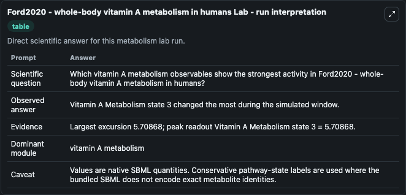
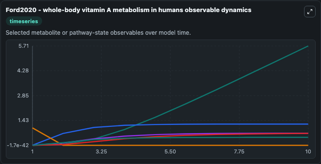
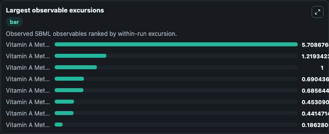
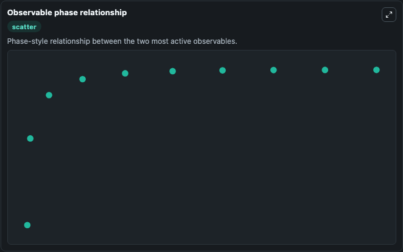

# Ford2020 - whole-body vitamin A metabolism in humans

Cleaned metabolism SBML ODE lab. The bundled SBML file remains the scientific source of truth.

Validation evidence: Tellurium loaded and simulated 40 floating species

## What You'll See

These dark-mode screenshots show the default Ford2020 - whole-body vitamin A metabolism in humans run over 10 model-time units with outputs sampled every 1. The lab exposes 5 inputs (`initial_vitamin_a_metabolism_state_1`, `initial_vitamin_a_metabolism_state_2`, `initial_vitamin_a_metabolism_state_3`, `initial_vitamin_a_metabolism_state_4`, `initial_vitamin_a_metabolism_state_5`) and 8 outputs (`vitamin_a_metabolism_state_1`, `vitamin_a_metabolism_state_2`, `vitamin_a_metabolism_state_3`, `vitamin_a_metabolism_state_4`, `vitamin_a_metabolism_state_5`, and 3 more). The default input state includes `initial_vitamin_a_metabolism_state_1`=`0`, `initial_vitamin_a_metabolism_state_2`=`0`, `initial_vitamin_a_metabolism_state_3`=`0`, `initial_vitamin_a_metabolism_state_4`=`0`. Metabolism Ford2020Whole Body Vitamin AMetabolism In Huma Model2312190001Model captures core biological behavior in the context of metabolism, sbml, biomodels_ebi using a biomodels_ebi-sourced OTHER model. When you run it, you can observe state and evaluate how the modeled system changes across runs.

<!-- BIOSIMULANT_VISUALS_START -->
### Output Visualizations

The run interpretation table summarizes the configured Ford2020 - whole-body vitamin A metabolism in humans simulation and its reported output statistics.

The observable dynamics plot traces the main reported outputs over the captured run window, including `vitamin_a_metabolism_state_1`, `vitamin_a_metabolism_state_2`, `vitamin_a_metabolism_state_3`, `vitamin_a_metabolism_state_4`, and 4 more.

The largest-observable-excursions chart ranks which reported variables moved the most during this simulation.

The phase-relationship plot compares paired observable values to show how the dominant trajectories move relative to one another.

<!-- BIOSIMULANT_VISUALS_END -->
