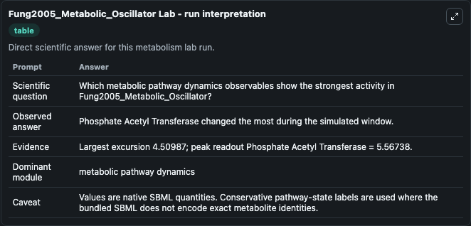
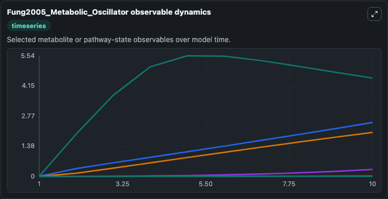
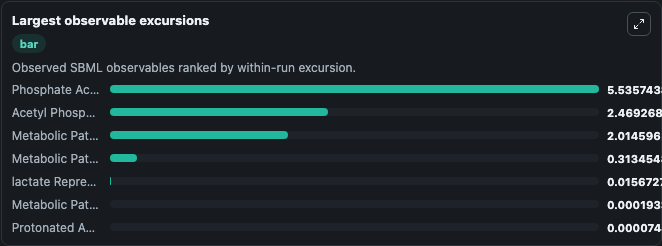
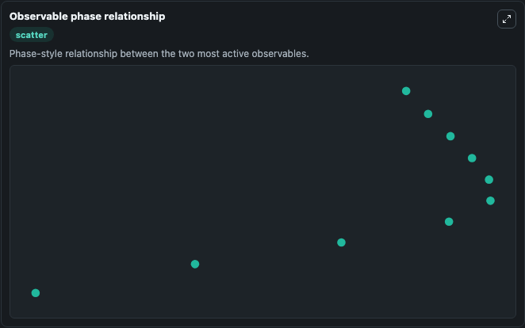

# Fung2005_Metabolic_Oscillator

Cleaned metabolism SBML ODE lab. The bundled SBML file remains the scientific source of truth.

Validation evidence: Tellurium loaded and simulated 7 floating species

## What You'll See

These dark-mode screenshots show the default Fung2005_Metabolic_Oscillator run over 10 model-time units with outputs sampled every 1. The lab exposes 5 inputs (`initial_metabolic_pathway_state_1`, `initial_acetyl_phosphate`, `initial_metabolic_pathway_state_3`, `initial_protonated_acetate`, `initial_lactate_repressor`) and 8 outputs (`metabolic_pathway_state_1`, `acetyl_phosphate`, `metabolic_pathway_state_3`, `protonated_acetate`, `lactate_repressor`, and 3 more). The default input state includes `initial_metabolic_pathway_state_1`=`0`, `initial_acetyl_phosphate`=`0`, `initial_metabolic_pathway_state_3`=`0`, `initial_protonated_acetate`=`0`. A Synthetic Gene-Metabolic Oscillator Reference: Fung et al; Nature (2005) 435:118-122 Name of kinetic law Reaction Glycolytic flux, V_gly: nil -&gt; AcCoA; Flux to TCA cycle/ETOH, V_TCA: AcCoA -&gt;. It can be used to explore metabolic flux dynamics and compare pathway behavior across conditions.

<!-- BIOSIMULANT_VISUALS_START -->
### Output Visualizations

The run interpretation table summarizes the configured Fung2005_Metabolic_Oscillator simulation and its reported output statistics.

The observable dynamics plot traces the main reported outputs over the captured run window, including `metabolic_pathway_state_1`, `acetyl_phosphate`, `metabolic_pathway_state_3`, `protonated_acetate`, and 4 more.

The largest-observable-excursions chart ranks which reported variables moved the most during this simulation.

The phase-relationship plot compares paired observable values to show how the dominant trajectories move relative to one another.

<!-- BIOSIMULANT_VISUALS_END -->
