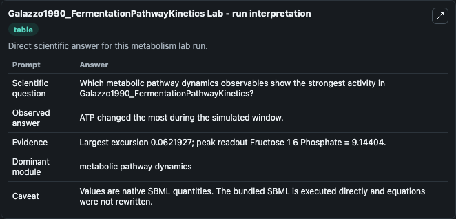
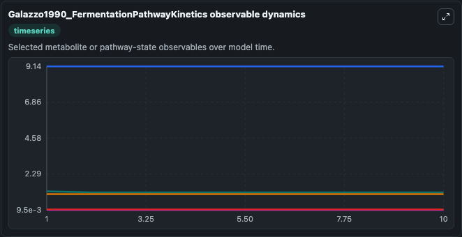
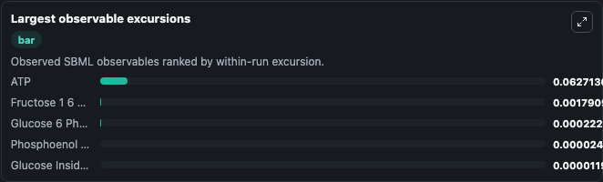
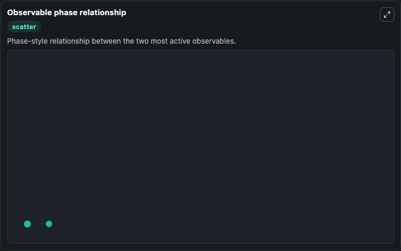

# Galazzo1990_FermentationPathwayKinetics

Cleaned metabolism SBML ODE lab. The bundled SBML file remains the scientific source of truth.

Validation evidence: Tellurium loaded and simulated 5 floating species

## What You'll See

These dark-mode screenshots show the default Galazzo1990_FermentationPathwayKinetics run over 10 model-time units with outputs sampled every 1. The lab exposes 5 inputs (`initial_glucose_inside_the_cell`, `initial_atp`, `initial_glucose_6_phosphate`, `initial_fructose_1_6_phosphate`, `initial_phosphoenol_pyruvate`) and 8 outputs (`glucose_inside_the_cell`, `atp`, `glucose_6_phosphate`, `fructose_1_6_phosphate`, `phosphoenol_pyruvate`, and 3 more). The default input state includes `initial_glucose_inside_the_cell`=`0.0345`, `initial_atp`=`1.19`, `initial_glucose_6_phosphate`=`1.011`, `initial_fructose_1_6_phosphate`=`9.144`. This a model from the article: Fermentation pathway kinetics and metabolic flux control in suspended and immobilized Saccharomyces cerevisiae Jorge L. It can be used to explore metabolic flux dynamics and compare pathway behavior across conditions.

<!-- BIOSIMULANT_VISUALS_START -->
### Output Visualizations

The run interpretation table summarizes the configured Galazzo1990_FermentationPathwayKinetics simulation and its reported output statistics.

The observable dynamics plot traces the main reported outputs over the captured run window, including `glucose_inside_the_cell`, `atp`, `glucose_6_phosphate`, `fructose_1_6_phosphate`, and 4 more.

The largest-observable-excursions chart ranks which reported variables moved the most during this simulation.

The phase-relationship plot compares paired observable values to show how the dominant trajectories move relative to one another.

<!-- BIOSIMULANT_VISUALS_END -->
