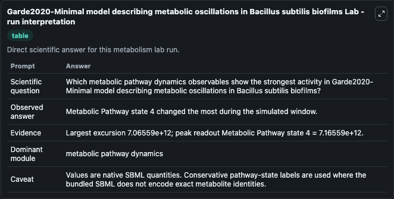
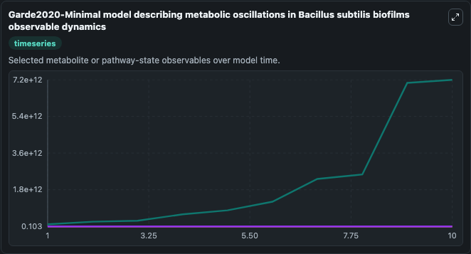
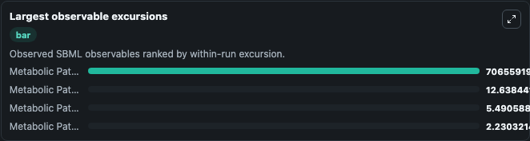
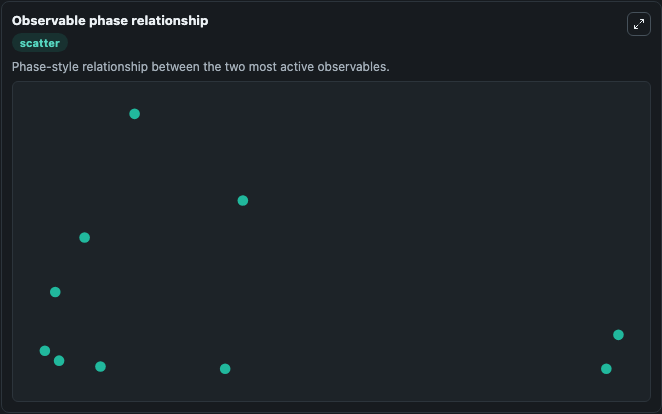

# Garde2020-Minimal model describing metabolic oscillations in Bacillus subtilis biofilms

Cleaned metabolism SBML ODE lab. The bundled SBML file remains the scientific source of truth.

Validation evidence: Tellurium loaded and simulated 4 floating species

## What You'll See

These dark-mode screenshots show the default Garde2020-Minimal model describing metabolic oscillations in Bacillus subtilis biofilms run over 10 model-time units with outputs sampled every 1. The lab exposes 4 inputs (`initial_metabolic_pathway_state_1`, `initial_metabolic_pathway_state_2`, `initial_metabolic_pathway_state_3`, `initial_metabolic_pathway_state_4`) and 7 outputs (`metabolic_pathway_state_1`, `metabolic_pathway_state_2`, `metabolic_pathway_state_3`, `metabolic_pathway_state_4`, `observable_values`, and 2 more). The default input state includes `initial_metabolic_pathway_state_1`=`1`, `initial_metabolic_pathway_state_2`=`1`, `initial_metabolic_pathway_state_3`=`1`, `initial_metabolic_pathway_state_4`=`100000000000`. Biofilms offer an excellent example of ecological interaction among bacteria. Temporal and spatial oscillations in biofilms are an emerging topic.

<!-- BIOSIMULANT_VISUALS_START -->
### Output Visualizations

The run interpretation table summarizes the configured Garde2020-Minimal model describing metabolic oscillations in Bacillus subtilis biofilms simulation and its reported output statistics.

The observable dynamics plot traces the main reported outputs over the captured run window, including `metabolic_pathway_state_1`, `metabolic_pathway_state_2`, `metabolic_pathway_state_3`, `metabolic_pathway_state_4`, and 3 more.

The largest-observable-excursions chart ranks which reported variables moved the most during this simulation.

The phase-relationship plot compares paired observable values to show how the dominant trajectories move relative to one another.

<!-- BIOSIMULANT_VISUALS_END -->
