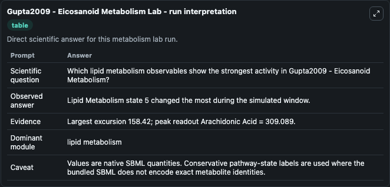
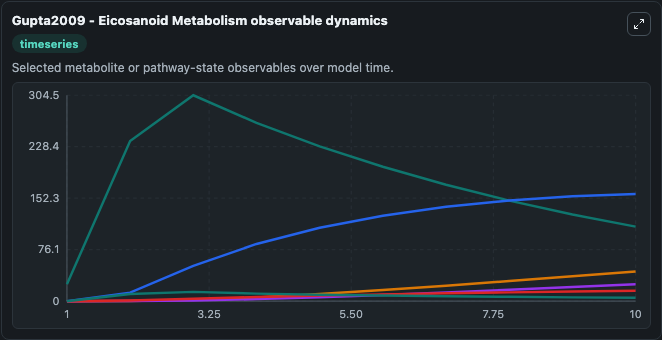
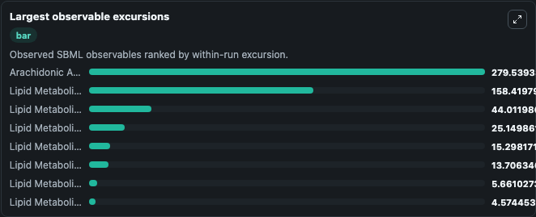
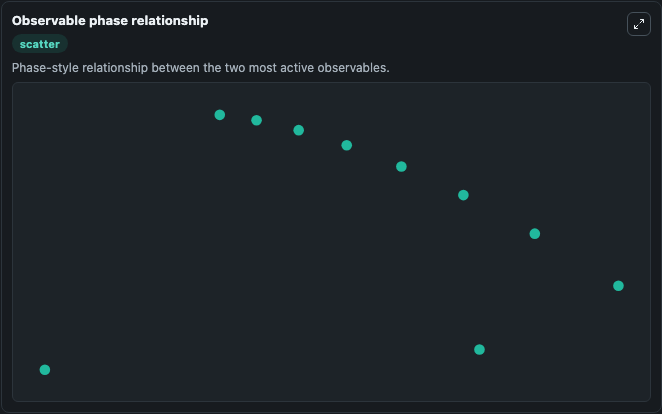

# Gupta2009 - Eicosanoid Metabolism

Cleaned metabolism SBML ODE lab. The bundled SBML file remains the scientific source of truth.

Validation evidence: Tellurium loaded and simulated 12 floating species

## What You'll See

These dark-mode screenshots show the default Gupta2009 - Eicosanoid Metabolism run over 10 model-time units with outputs sampled every 1. The lab exposes 5 inputs (`initial_lipid_metabolism_state_1`, `initial_lipid_metabolism_state_2`, `initial_lipid_metabolism_state_3`, `initial_lipid_metabolism_state_4`, `initial_lipid_metabolism_state_5`) and 8 outputs (`lipid_metabolism_state_1`, `lipid_metabolism_state_2`, `lipid_metabolism_state_3`, `lipid_metabolism_state_4`, `lipid_metabolism_state_5`, and 3 more). The default input state includes `initial_lipid_metabolism_state_1`=`0`, `initial_lipid_metabolism_state_2`=`0`, `initial_lipid_metabolism_state_3`=`0`, `initial_lipid_metabolism_state_4`=`0`. Gupta2009 - Eicosanoid Metabolism Integrated model of eicosanoid metabolism and signaling based on lipidomics flux analysis. This model is described in the article: An integrated model of eicosanoid m.

<!-- BIOSIMULANT_VISUALS_START -->
### Output Visualizations

The run interpretation table summarizes the configured Gupta2009 - Eicosanoid Metabolism simulation and its reported output statistics.

The observable dynamics plot traces the main reported outputs over the captured run window, including `lipid_metabolism_state_1`, `lipid_metabolism_state_2`, `lipid_metabolism_state_3`, `lipid_metabolism_state_4`, and 4 more.

The largest-observable-excursions chart ranks which reported variables moved the most during this simulation.

The phase-relationship plot compares paired observable values to show how the dominant trajectories move relative to one another.

<!-- BIOSIMULANT_VISUALS_END -->
