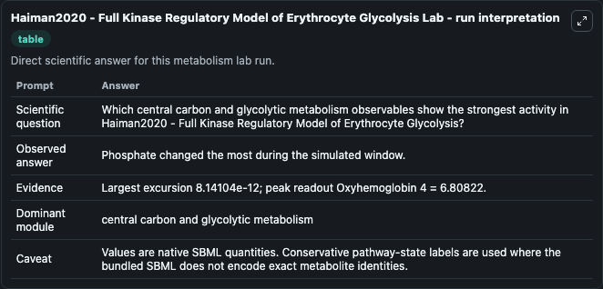
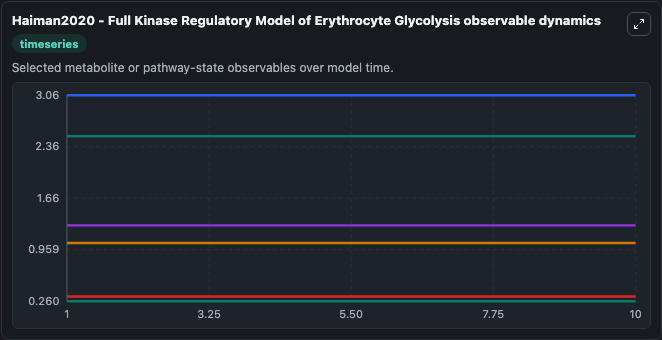
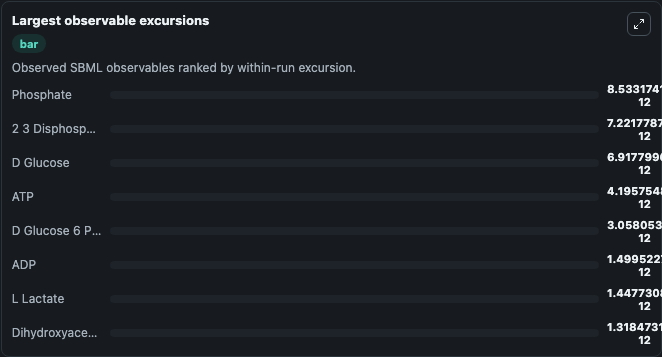
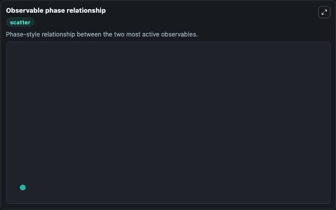

# Haiman2020 - Full Kinase Regulatory Model of Erythrocyte Glycolysis

Cleaned metabolism SBML ODE lab. The bundled SBML file remains the scientific source of truth.

Validation evidence: Tellurium loaded and simulated 80 floating species

## What You'll See

These dark-mode screenshots show the default Haiman2020 - Full Kinase Regulatory Model of Erythrocyte Glycolysis run over 10 model-time units with outputs sampled every 1. The lab exposes 5 inputs (`initial_d_glucose`, `initial_d_glucose_6_phosphate`, `initial_d_fructose_6_phosphate`, `initial_d_fructose_1_6_bisphosphate`, `initial_dihydroxyacetone_phosphate`) and 8 outputs (`d_glucose`, `d_glucose_6_phosphate`, `d_fructose_6_phosphate`, `d_fructose_1_6_bisphosphate`, `dihydroxyacetone_phosphate`, and 3 more). The default input state includes `initial_d_glucose`=`1.05022808997895`, `initial_d_glucose_6_phosphate`=`0.323536985432573`, `initial_d_fructose_6_phosphate`=`0.132524163873696`, `initial_d_fructose_1_6_bisphosphate`=`0.0114713270708866`. Dynamic model utilizing mass action kinetics to elucidate network-level effects of allosteric regulation in erythrocyte metabolism. The full kinase regulatory model includes the glycolytic pathway, th.

<!-- BIOSIMULANT_VISUALS_START -->
### Output Visualizations

The run interpretation table summarizes the configured Haiman2020 - Full Kinase Regulatory Model of Erythrocyte Glycolysis simulation and its reported output statistics.

The observable dynamics plot traces the main reported outputs over the captured run window, including `d_glucose`, `d_glucose_6_phosphate`, `d_fructose_6_phosphate`, `d_fructose_1_6_bisphosphate`, and 4 more.

The largest-observable-excursions chart ranks which reported variables moved the most during this simulation.

The phase-relationship plot compares paired observable values to show how the dominant trajectories move relative to one another.

<!-- BIOSIMULANT_VISUALS_END -->
