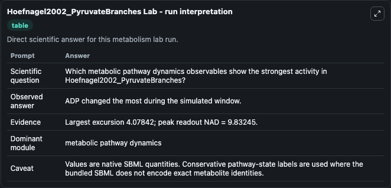
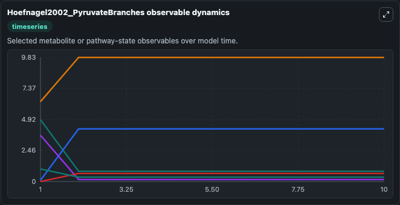
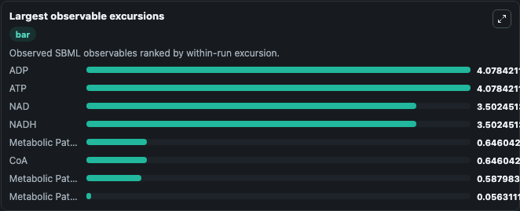

# Hoefnagel2002_PyruvateBranches

Cleaned metabolism SBML ODE lab. The bundled SBML file remains the scientific source of truth.

Validation evidence: Tellurium loaded and simulated 11 floating species

## What You'll See

These dark-mode screenshots show the default Hoefnagel2002_PyruvateBranches run over 10 model-time units with outputs sampled every 1. The lab exposes 5 inputs (`initial_adp`, `initial_nad`, `initial_atp`, `initial_nadh`, `initial_metabolic_pathway_state_5`) and 8 outputs (`adp`, `nad`, `atp`, `nadh`, `metabolic_pathway_state_5`, and 3 more). The default input state includes `initial_adp`=`4.9`, `initial_nad`=`6.33`, `initial_atp`=`0.1`, `initial_nadh`=`3.67`. This a model from the article: Metabolic engineering of lactic acid bacteria, the combined approach: kinetic modelling, metabolic control and experimental analysis. It can be used to explore metabolic flux dynamics and compare pathway behavior across conditions.

<!-- BIOSIMULANT_VISUALS_START -->
### Output Visualizations

The run interpretation table summarizes the configured Hoefnagel2002_PyruvateBranches simulation and its reported output statistics.

The observable dynamics plot traces the main reported outputs over the captured run window, including `adp`, `nad`, `atp`, `nadh`, and 4 more.

The largest-observable-excursions chart ranks which reported variables moved the most during this simulation.

The phase-relationship plot compares paired observable values to show how the dominant trajectories move relative to one another.

<!-- BIOSIMULANT_VISUALS_END -->
