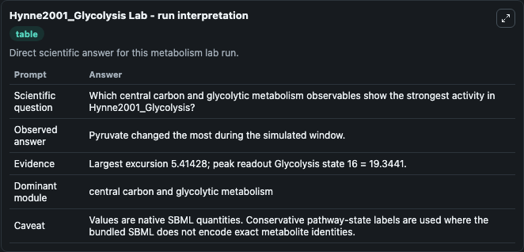
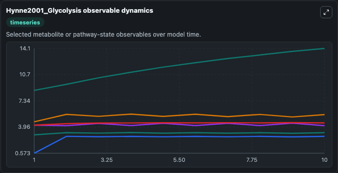
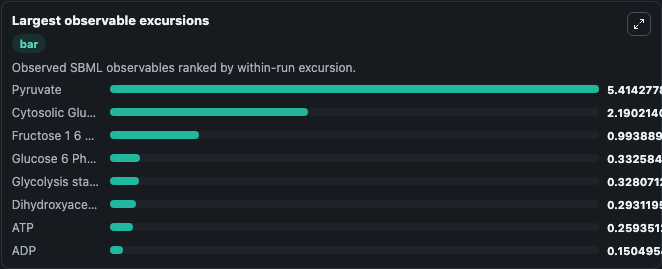
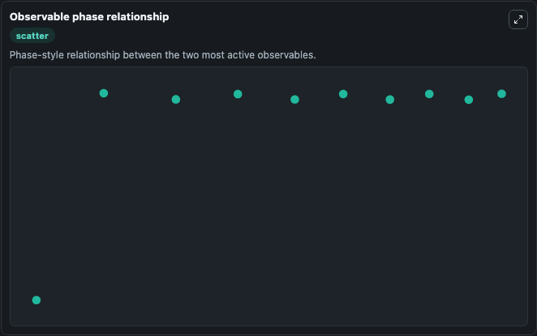

# Hynne2001_Glycolysis

Cleaned metabolism SBML ODE lab. The bundled SBML file remains the scientific source of truth.

Validation evidence: Tellurium loaded and simulated 22 floating species

## What You'll See

These dark-mode screenshots show the default Hynne2001_Glycolysis run over 10 model-time units with outputs sampled every 1. The lab exposes 5 inputs (`initial_extracellular_glucose`, `initial_cytosolic_glucose`, `initial_atp`, `initial_glucose_6_phosphate`, `initial_adp`) and 8 outputs (`extracellular_glucose`, `cytosolic_glucose`, `atp`, `glucose_6_phosphate`, `adp`, and 3 more). The default input state includes `initial_extracellular_glucose`=`6.7`, `initial_cytosolic_glucose`=`0.573074`, `initial_atp`=`2.1`, `initial_glucose_6_phosphate`=`4.2`. The model reproduces Fig 6 of the paper. It can be used to explore metabolic flux dynamics and compare pathway behavior across conditions.

<!-- BIOSIMULANT_VISUALS_START -->
### Output Visualizations

The run interpretation table summarizes the configured Hynne2001_Glycolysis simulation and its reported output statistics.

The observable dynamics plot traces the main reported outputs over the captured run window, including `extracellular_glucose`, `cytosolic_glucose`, `atp`, `glucose_6_phosphate`, and 4 more.

The largest-observable-excursions chart ranks which reported variables moved the most during this simulation.

The phase-relationship plot compares paired observable values to show how the dominant trajectories move relative to one another.

<!-- BIOSIMULANT_VISUALS_END -->
