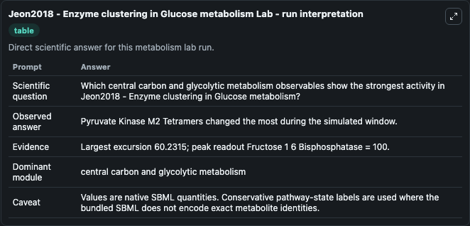
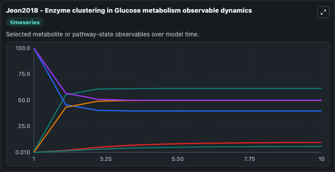
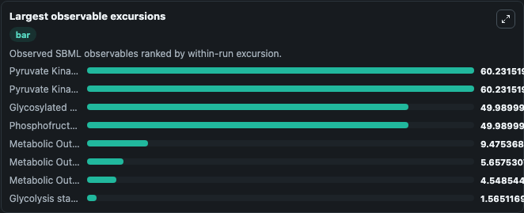
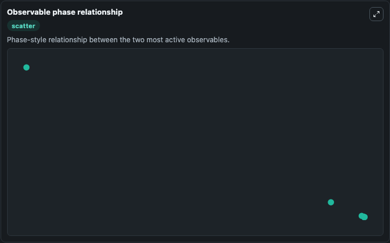

# Jeon2018 - Enzyme clustering in Glucose metabolism

Cleaned metabolism SBML ODE lab. The bundled SBML file remains the scientific source of truth.

Validation evidence: Tellurium loaded and simulated 19 floating species

## What You'll See

These dark-mode screenshots show the default Jeon2018 - Enzyme clustering in Glucose metabolism run over 10 model-time units with outputs sampled every 1. The lab exposes 5 inputs (`initial_glycolysis_state_1`, `initial_fructose_6_phosphate`, `initial_fructose_1_6_bisphosphate`, `initial_observable_3_phosphoglycerate`, `initial_glycolysis_state_5`) and 8 outputs (`glycolysis_state_1`, `fructose_6_phosphate`, `fructose_1_6_bisphosphate`, `observable_3_phosphoglycerate`, `glycolysis_state_5`, and 3 more). The default input state includes `initial_glycolysis_state_1`=`0.01`, `initial_fructose_6_phosphate`=`0.01`, `initial_fructose_1_6_bisphosphate`=`0.01`, `initial_observable_3_phosphoglycerate`=`0.01`. Miji Jeon, Hye-Won Kang & Songon An. A Mathematical Model for Enzyme Clustering in Glucose Metabolism.

<!-- BIOSIMULANT_VISUALS_START -->
### Output Visualizations

The run interpretation table summarizes the configured Jeon2018 - Enzyme clustering in Glucose metabolism simulation and its reported output statistics.

The observable dynamics plot traces the main reported outputs over the captured run window, including `glycolysis_state_1`, `fructose_6_phosphate`, `fructose_1_6_bisphosphate`, `observable_3_phosphoglycerate`, and 4 more.

The largest-observable-excursions chart ranks which reported variables moved the most during this simulation.

The phase-relationship plot compares paired observable values to show how the dominant trajectories move relative to one another.

<!-- BIOSIMULANT_VISUALS_END -->
