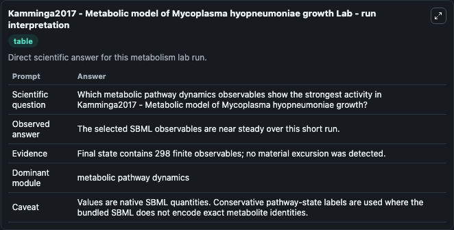
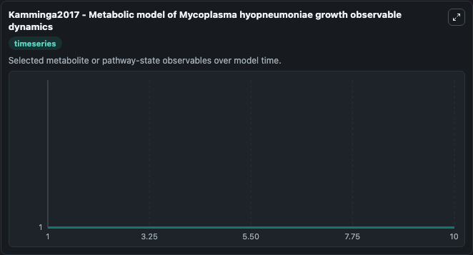
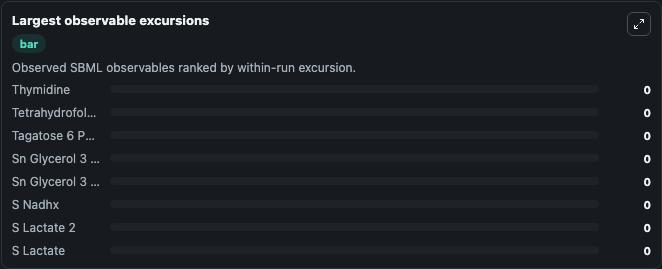

# Kamminga2017 - Metabolic model of Mycoplasma hyopneumoniae growth

Cleaned metabolism SBML ODE lab. The bundled SBML file remains the scientific source of truth.

Validation evidence: Tellurium loaded and simulated 298 floating species

## What You'll See

These dark-mode screenshots show the default Kamminga2017 - Metabolic model of Mycoplasma hyopneumoniae growth run over 10 model-time units with outputs sampled every 1. The lab exposes 5 inputs (`initial_metabolic_pathway_state_1`, `initial_lipoyl_adenylate`, `initial_metabolic_pathway_state_3`, `initial_l_ribulose_5_phosphate`, `initial_l_valine`) and 8 outputs (`metabolic_pathway_state_1`, `lipoyl_adenylate`, `metabolic_pathway_state_3`, `l_ribulose_5_phosphate`, `l_valine`, and 3 more). The default input state includes `initial_metabolic_pathway_state_1`=`1`, `initial_lipoyl_adenylate`=`1`, `initial_metabolic_pathway_state_3`=`1`, `initial_l_ribulose_5_phosphate`=`1`. Kamminga2017 - Metabolic model of Mycoplasma hyopneumoniae growth This model is described in the article: Metabolic modeling of energy balances in Mycoplasma hyopneumoniae shows that pyruvate addition. It can be used to explore metabolic flux dynamics and compare pathway behavior across conditions.

<!-- BIOSIMULANT_VISUALS_START -->
### Output Visualizations

The run interpretation table summarizes the configured Kamminga2017 - Metabolic model of Mycoplasma hyopneumoniae growth simulation and its reported output statistics.

The observable dynamics plot traces the main reported outputs over the captured run window, including `metabolic_pathway_state_1`, `lipoyl_adenylate`, `metabolic_pathway_state_3`, `l_ribulose_5_phosphate`, and 4 more.

The largest-observable-excursions chart ranks which reported variables moved the most during this simulation.

The phase-relationship plot compares paired observable values to show how the dominant trajectories move relative to one another.

<!-- BIOSIMULANT_VISUALS_END -->
