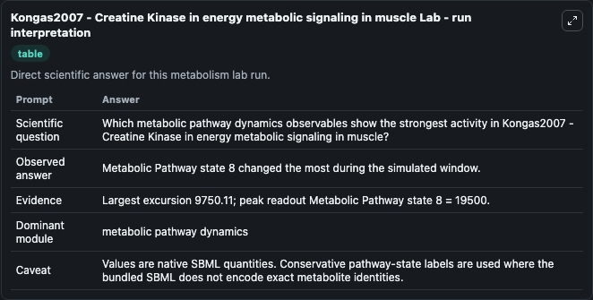
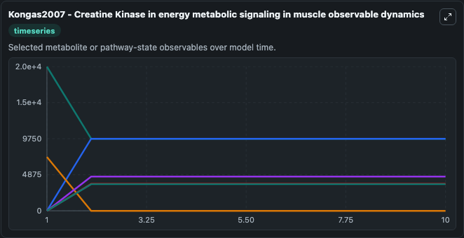
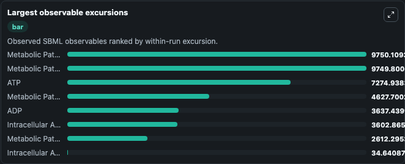
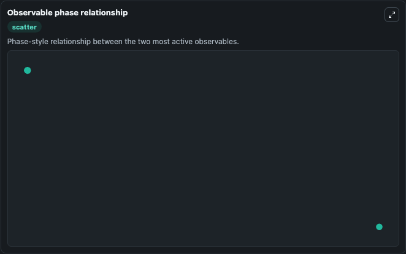

# Kongas2007 - Creatine Kinase in energy metabolic signaling in muscle

Cleaned metabolism SBML ODE lab. The bundled SBML file remains the scientific source of truth.

Validation evidence: Tellurium loaded and simulated 10 floating species

## What You'll See

These dark-mode screenshots show the default Kongas2007 - Creatine Kinase in energy metabolic signaling in muscle run over 10 model-time units with outputs sampled every 1. The lab exposes 5 inputs (`initial_intracellular_adp`, `initial_intracellular_atp`, `initial_metabolic_pathway_state_3`, `initial_metabolic_pathway_state_4`, `initial_metabolic_pathway_state_5`) and 8 outputs (`intracellular_adp`, `intracellular_atp`, `metabolic_pathway_state_3`, `metabolic_pathway_state_4`, `metabolic_pathway_state_5`, and 3 more). The default input state includes `initial_intracellular_adp`=`0`, `initial_intracellular_atp`=`0`, `initial_metabolic_pathway_state_3`=`0`, `initial_metabolic_pathway_state_4`=`0`. Kongas2007 - Creatine Kinase in energy metabolic signaling in muscle This model is described in the article: Creatine kinase in energy metabolic signaling in muscle Olav Kongas and Johannes H. It can be used to explore metabolic flux dynamics and compare pathway behavior across conditions.

<!-- BIOSIMULANT_VISUALS_START -->
### Output Visualizations

The run interpretation table summarizes the configured Kongas2007 - Creatine Kinase in energy metabolic signaling in muscle simulation and its reported output statistics.

The observable dynamics plot traces the main reported outputs over the captured run window, including `intracellular_adp`, `intracellular_atp`, `metabolic_pathway_state_3`, `metabolic_pathway_state_4`, and 4 more.

The largest-observable-excursions chart ranks which reported variables moved the most during this simulation.

The phase-relationship plot compares paired observable values to show how the dominant trajectories move relative to one another.

<!-- BIOSIMULANT_VISUALS_END -->
