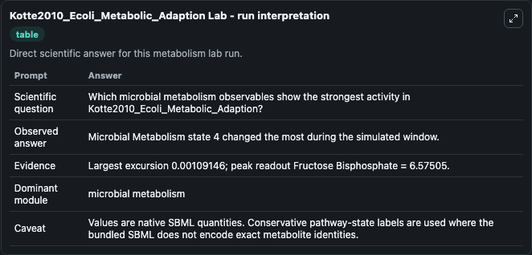
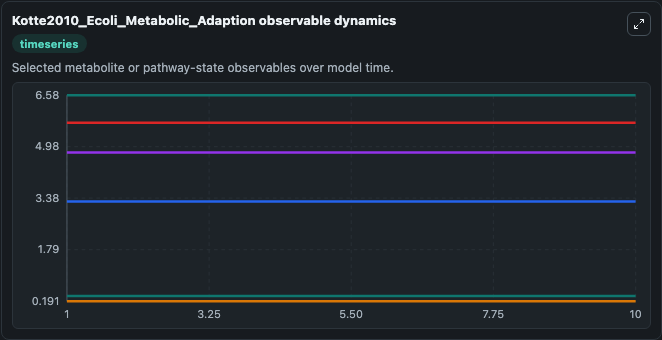
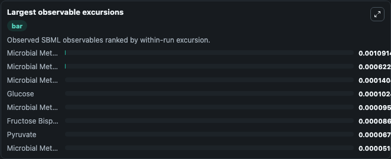
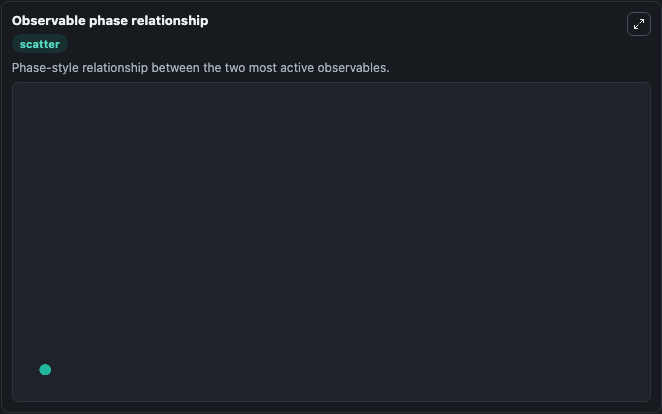

# Kotte2010_Ecoli_Metabolic_Adaption

Cleaned metabolism SBML ODE lab. The bundled SBML file remains the scientific source of truth.

Validation evidence: Tellurium loaded and simulated 47 floating species

## What You'll See

These dark-mode screenshots show the default Kotte2010_Ecoli_Metabolic_Adaption run over 10 model-time units with outputs sampled every 1. The lab exposes 5 inputs (`initial_microbial_metabolism_state_1`, `initial_microbial_metabolism_state_2`, `initial_glucose`, `initial_microbial_metabolism_state_4`, `initial_microbial_metabolism_state_5`) and 8 outputs (`microbial_metabolism_state_1`, `microbial_metabolism_state_2`, `glucose`, `microbial_metabolism_state_4`, `microbial_metabolism_state_5`, and 3 more). The default input state includes `initial_microbial_metabolism_state_1`=`0.03`, `initial_microbial_metabolism_state_2`=`0`, `initial_glucose`=`4.8`, `initial_microbial_metabolism_state_4`=`0.351972298`. This is the model described in: Bacterial adaptation through distributed sensing of metabolic fluxes Oliver Kotte, Judith B Zaugg and Matthias Heinemann; Mol Sys Biol 2010; 6 :355. It can be used to explore metabolic flux dynamics and compare pathway behavior across conditions.

<!-- BIOSIMULANT_VISUALS_START -->
### Output Visualizations

The run interpretation table summarizes the configured Kotte2010_Ecoli_Metabolic_Adaption simulation and its reported output statistics.

The observable dynamics plot traces the main reported outputs over the captured run window, including `microbial_metabolism_state_1`, `microbial_metabolism_state_2`, `glucose`, `microbial_metabolism_state_4`, and 4 more.

The largest-observable-excursions chart ranks which reported variables moved the most during this simulation.

The phase-relationship plot compares paired observable values to show how the dominant trajectories move relative to one another.

<!-- BIOSIMULANT_VISUALS_END -->
