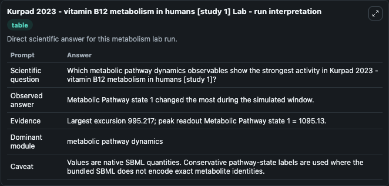
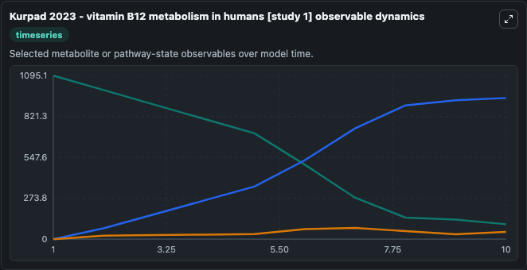
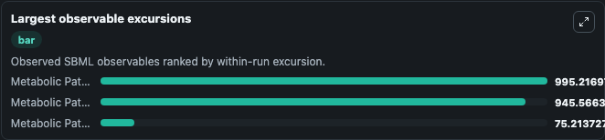
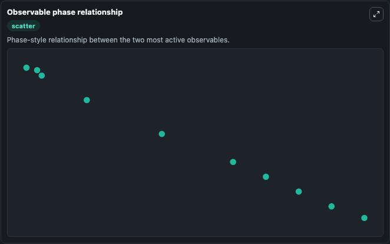

# Kurpad 2023 - vitamin B12 metabolism in humans [study 1]

Cleaned metabolism SBML ODE lab. The bundled SBML file remains the scientific source of truth.

Validation evidence: Tellurium loaded and simulated 3 floating species

## What You'll See

These dark-mode screenshots show the default Kurpad 2023 - vitamin B12 metabolism in humans [study 1] run over 10 model-time units with outputs sampled every 1. The lab exposes 3 inputs (`initial_metabolic_pathway_state_1`, `initial_metabolic_pathway_state_2`, `initial_metabolic_pathway_state_3`) and 6 outputs (`metabolic_pathway_state_1`, `metabolic_pathway_state_2`, `metabolic_pathway_state_3`, `observable_values`, `run_summary`, and 1 more). The default input state includes `initial_metabolic_pathway_state_1`=`1738.3`, `initial_metabolic_pathway_state_2`=`0`, `initial_metabolic_pathway_state_3`=`0`. Metabolism Kurpad2023Vitamin B12Metabolism In Humans Stu Model2503310002Model captures core biological behavior in the context of metabolism, sbml, biomodels_ebi using a biomodels_ebi-sourced OTHER model. When you run it, you can observe state and evaluate how the modeled system changes across runs.

<!-- BIOSIMULANT_VISUALS_START -->
### Output Visualizations

The run interpretation table summarizes the configured Kurpad 2023 - vitamin B12 metabolism in humans [study 1] simulation and its reported output statistics.

The observable dynamics plot traces the main reported outputs over the captured run window, including `metabolic_pathway_state_1`, `metabolic_pathway_state_2`, `metabolic_pathway_state_3`, `observable_values`, and 2 more.

The largest-observable-excursions chart ranks which reported variables moved the most during this simulation.

The phase-relationship plot compares paired observable values to show how the dominant trajectories move relative to one another.

<!-- BIOSIMULANT_VISUALS_END -->
