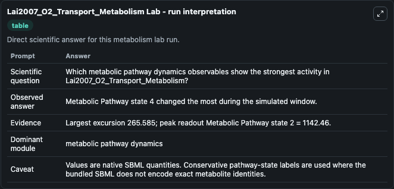
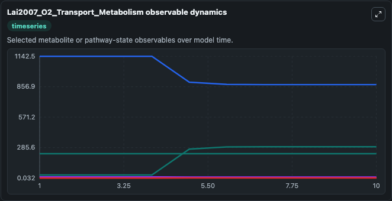
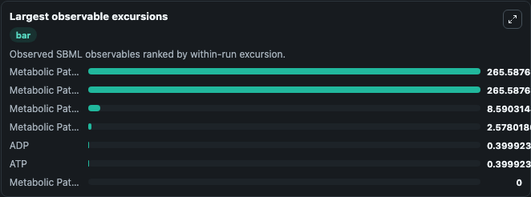
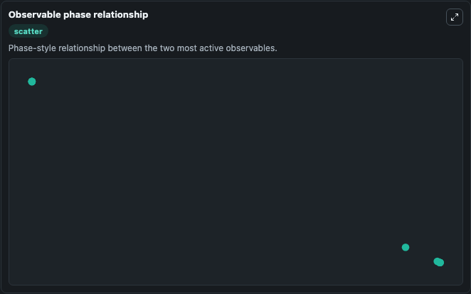

# Lai2007_O2_Transport_Metabolism

Cleaned metabolism SBML ODE lab. The bundled SBML file remains the scientific source of truth.

Validation evidence: Tellurium loaded and simulated 7 floating species

## What You'll See

These dark-mode screenshots show the default Lai2007_O2_Transport_Metabolism run over 10 model-time units with outputs sampled every 1. The lab exposes 5 inputs (`initial_atp`, `initial_metabolic_pathway_state_2`, `initial_adp`, `initial_metabolic_pathway_state_4`, `initial_metabolic_pathway_state_5`) and 8 outputs (`atp`, `metabolic_pathway_state_2`, `adp`, `metabolic_pathway_state_4`, `metabolic_pathway_state_5`, and 3 more). The default input state includes `initial_atp`=`8.198857`, `initial_metabolic_pathway_state_2`=`40.98942`, `initial_adp`=`0.001142`, `initial_metabolic_pathway_state_4`=`1.01056`. This file describes the SBML version of the mathematical model in the following journal article: Linking Pulmonary Oxygen Uptake, Muscle Oxygen Utilization and Cellular Metabolism during Exercise, Ann. It can be used to explore metabolic flux dynamics and compare pathway behavior across conditions.

<!-- BIOSIMULANT_VISUALS_START -->
### Output Visualizations

The run interpretation table summarizes the configured Lai2007_O2_Transport_Metabolism simulation and its reported output statistics.

The observable dynamics plot traces the main reported outputs over the captured run window, including `atp`, `metabolic_pathway_state_2`, `adp`, `metabolic_pathway_state_4`, and 4 more.

The largest-observable-excursions chart ranks which reported variables moved the most during this simulation.

The phase-relationship plot compares paired observable values to show how the dominant trajectories move relative to one another.

<!-- BIOSIMULANT_VISUALS_END -->
