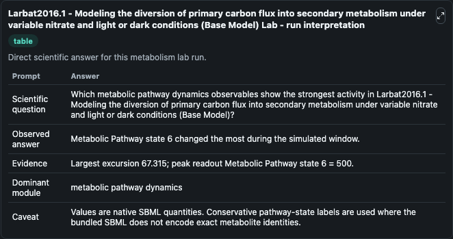
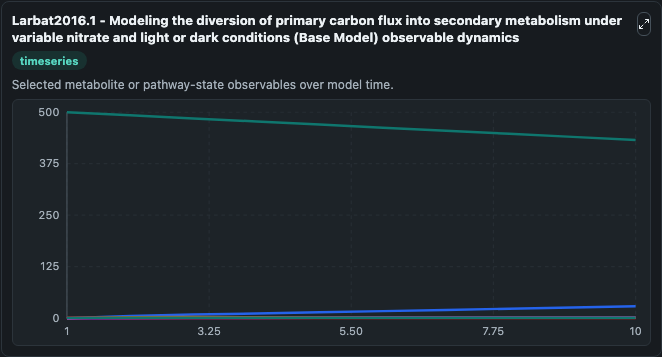
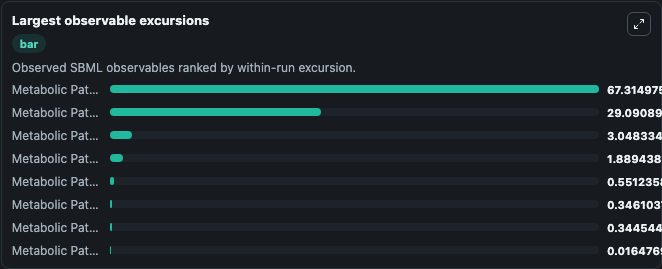
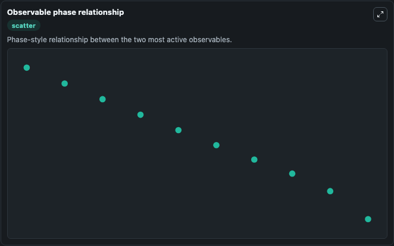

# Larbat2016.1 - Modeling the diversion of primary carbon flux into secondary metabolism under variable nitrate and light or dark conditions (Base Model)

Cleaned metabolism SBML ODE lab. The bundled SBML file remains the scientific source of truth.

Validation evidence: Tellurium loaded and simulated 9 floating species

## What You'll See

These dark-mode screenshots show the default Larbat2016.1 - Modeling the diversion of primary carbon flux into secondary metabolism under variable nitrate and light or dark conditions (Base Model) run over 10 model-time units with outputs sampled every 1. The lab exposes 5 inputs (`initial_metabolic_pathway_state_1`, `initial_metabolic_pathway_state_2`, `initial_metabolic_pathway_state_3`, `initial_metabolic_pathway_state_4`, `initial_metabolic_pathway_state_5`) and 8 outputs (`metabolic_pathway_state_1`, `metabolic_pathway_state_2`, `metabolic_pathway_state_3`, `metabolic_pathway_state_4`, `metabolic_pathway_state_5`, and 3 more). The default input state includes `initial_metabolic_pathway_state_1`=`0.7`, `initial_metabolic_pathway_state_2`=`8.06`, `initial_metabolic_pathway_state_3`=`0.00001`, `initial_metabolic_pathway_state_4`=`5`. This is a global mathematical model describing metabolic partitioning of carbon resources in plants between growth and defense, as a function of nitrate fertilization. It can be used to explore metabolic flux dynamics and compare pathway behavior across conditions.

<!-- BIOSIMULANT_VISUALS_START -->
### Output Visualizations

The run interpretation table summarizes the configured Larbat2016.1 - Modeling the diversion of primary carbon flux into secondary metabolism under variable nitrate and light or dark conditions (Base Model) simulation and its reported output statistics.

The observable dynamics plot traces the main reported outputs over the captured run window, including `metabolic_pathway_state_1`, `metabolic_pathway_state_2`, `metabolic_pathway_state_3`, `metabolic_pathway_state_4`, and 4 more.

The largest-observable-excursions chart ranks which reported variables moved the most during this simulation.

The phase-relationship plot compares paired observable values to show how the dominant trajectories move relative to one another.

<!-- BIOSIMULANT_VISUALS_END -->
