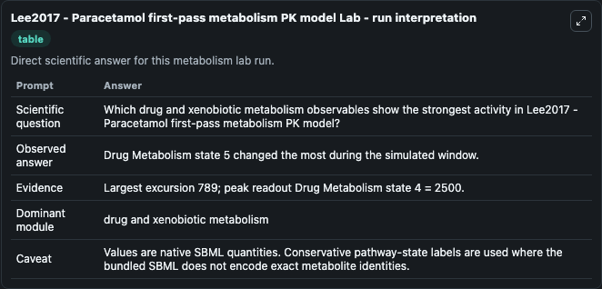
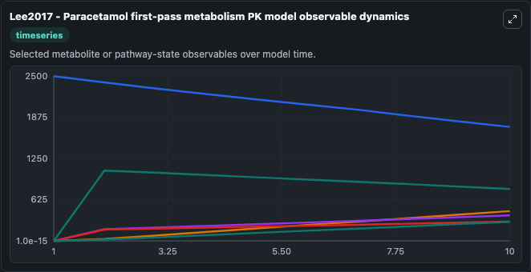
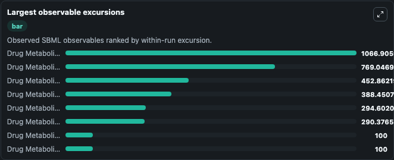
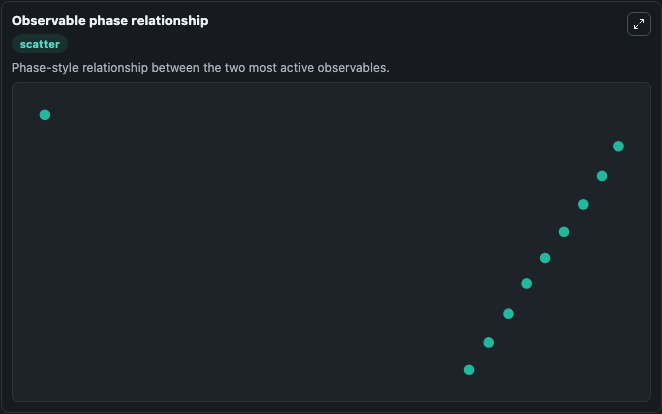

# Lee2017 - Paracetamol first-pass metabolism PK model

Cleaned metabolism SBML ODE lab. The bundled SBML file remains the scientific source of truth.

Validation evidence: Tellurium loaded and simulated 12 floating species

## What You'll See

These dark-mode screenshots show the default Lee2017 - Paracetamol first-pass metabolism PK model run over 10 model-time units with outputs sampled every 1. The lab exposes 5 inputs (`initial_drug_metabolism_state_1`, `initial_drug_metabolism_state_2`, `initial_drug_metabolism_state_3`, `initial_drug_metabolism_state_4`, `initial_drug_metabolism_state_5`) and 8 outputs (`drug_metabolism_state_1`, `drug_metabolism_state_2`, `drug_metabolism_state_3`, `drug_metabolism_state_4`, `drug_metabolism_state_5`, and 3 more). The default input state includes `initial_drug_metabolism_state_1`=`500`, `initial_drug_metabolism_state_2`=`0.33`, `initial_drug_metabolism_state_3`=`380`, `initial_drug_metabolism_state_4`=`2500`. Authors developed a microfluidic gut-liver co-culture chip that aims to reproduce the first-pass metabolism of oral drugs. The study suggests the possibility of reproducing the human PK profile on a c.

<!-- BIOSIMULANT_VISUALS_START -->
### Output Visualizations

The run interpretation table summarizes the configured Lee2017 - Paracetamol first-pass metabolism PK model simulation and its reported output statistics.

The observable dynamics plot traces the main reported outputs over the captured run window, including `drug_metabolism_state_1`, `drug_metabolism_state_2`, `drug_metabolism_state_3`, `drug_metabolism_state_4`, and 4 more.

The largest-observable-excursions chart ranks which reported variables moved the most during this simulation.

The phase-relationship plot compares paired observable values to show how the dominant trajectories move relative to one another.

<!-- BIOSIMULANT_VISUALS_END -->
