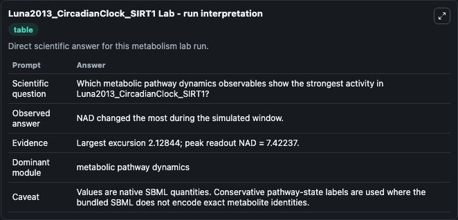
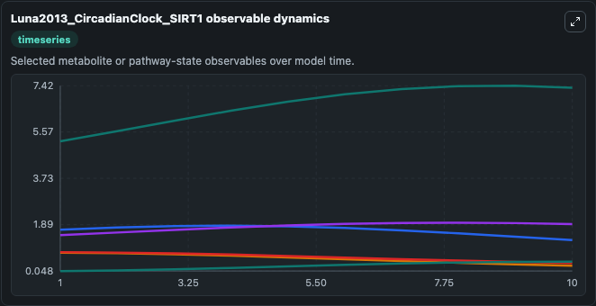
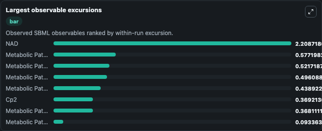
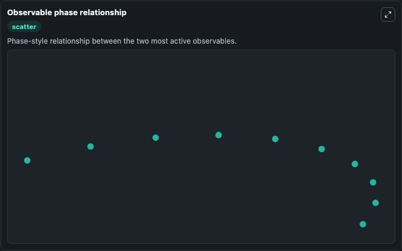

# Luna2013_CircadianClock_SIRT1

Cleaned metabolism SBML ODE lab. The bundled SBML file remains the scientific source of truth.

Validation evidence: Tellurium loaded and simulated 9 floating species

## What You'll See

These dark-mode screenshots show the default Luna2013_CircadianClock_SIRT1 run over 10 model-time units with outputs sampled every 1. The lab exposes 5 inputs (`initial_metabolic_pathway_state_1`, `initial_metabolic_pathway_state_2`, `initial_metabolic_pathway_state_3`, `initial_cp2`, `initial_nad`) and 8 outputs (`metabolic_pathway_state_1`, `metabolic_pathway_state_2`, `metabolic_pathway_state_3`, `cp2`, `nad`, and 3 more). The default input state includes `initial_metabolic_pathway_state_1`=`1.54597010260715`, `initial_metabolic_pathway_state_2`=`0.101793613432364`, `initial_metabolic_pathway_state_3`=`0.0723157888573554`, `initial_cp2`=`0.0475926846633792`. An in silico model to examine damage-induced circadian phase shifts by investigating a possible mechanism linking circadian rhythms to metabolism. The proposed model involves two DNA damage response p.

<!-- BIOSIMULANT_VISUALS_START -->
### Output Visualizations

The run interpretation table summarizes the configured Luna2013_CircadianClock_SIRT1 simulation and its reported output statistics.

The observable dynamics plot traces the main reported outputs over the captured run window, including `metabolic_pathway_state_1`, `metabolic_pathway_state_2`, `metabolic_pathway_state_3`, `cp2`, and 4 more.

The largest-observable-excursions chart ranks which reported variables moved the most during this simulation.

The phase-relationship plot compares paired observable values to show how the dominant trajectories move relative to one another.

<!-- BIOSIMULANT_VISUALS_END -->
