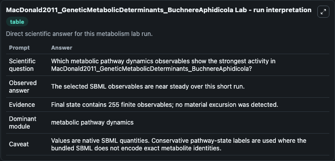
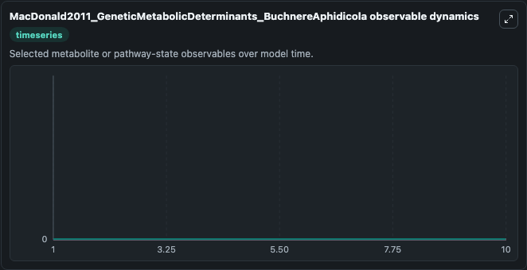
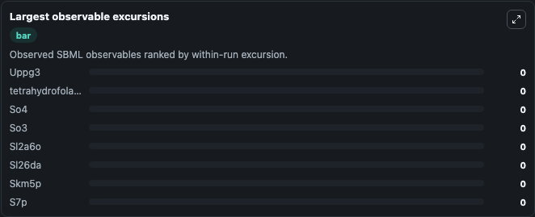
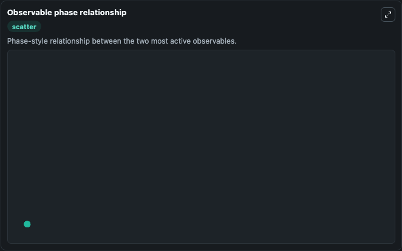

# MacDonald2011_GeneticMetabolicDeterminants_BuchnereAphidicola

Cleaned metabolism SBML ODE lab. The bundled SBML file remains the scientific source of truth.

Validation evidence: Tellurium loaded and simulated 255 floating species

## What You'll See

These dark-mode screenshots show the default MacDonald2011_GeneticMetabolicDeterminants_BuchnereAphidicola run over 10 model-time units with outputs sampled every 1. The lab exposes 5 inputs (`initial_metabolic_pathway_state_1`, `initial_tetrahydrofolate`, `initial_metabolic_pathway_state_3`, `initial_h2o`, `initial_metabolic_pathway_state_5`) and 8 outputs (`metabolic_pathway_state_1`, `tetrahydrofolate`, `metabolic_pathway_state_3`, `h2o`, `metabolic_pathway_state_5`, and 3 more). The default input state includes `initial_metabolic_pathway_state_1`=`0`, `initial_tetrahydrofolate`=`0`, `initial_metabolic_pathway_state_3`=`0`, `initial_h2o`=`0`. This model is from the article: Genetic and metabolic determinants of nutritional phenotype in an insect-bacterial symbiosis. It can be used to explore metabolic flux dynamics and compare pathway behavior across conditions.

<!-- BIOSIMULANT_VISUALS_START -->
### Output Visualizations

The run interpretation table summarizes the configured MacDonald2011_GeneticMetabolicDeterminants_BuchnereAphidicola simulation and its reported output statistics.

The observable dynamics plot traces the main reported outputs over the captured run window, including `metabolic_pathway_state_1`, `tetrahydrofolate`, `metabolic_pathway_state_3`, `h2o`, and 4 more.

The largest-observable-excursions chart ranks which reported variables moved the most during this simulation.

The phase-relationship plot compares paired observable values to show how the dominant trajectories move relative to one another.

<!-- BIOSIMULANT_VISUALS_END -->
