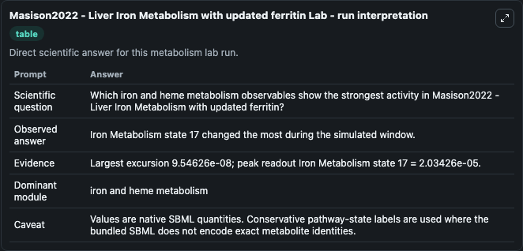
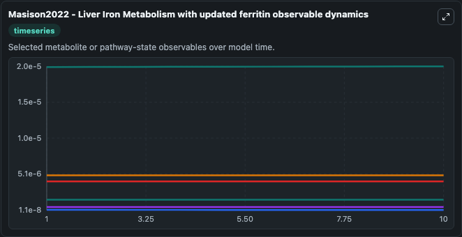
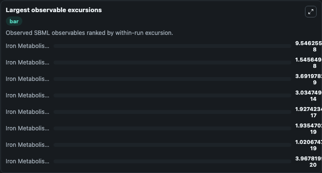

# Masison2022 - Liver Iron Metabolism with updated ferritin

Cleaned metabolism SBML ODE lab. The bundled SBML file remains the scientific source of truth.

Validation evidence: Tellurium loaded and simulated 19 floating species

## What You'll See

These dark-mode screenshots show the default Masison2022 - Liver Iron Metabolism with updated ferritin run over 10 model-time units with outputs sampled every 1. The lab exposes 5 inputs (`initial_iron_metabolism_state_1`, `initial_iron_metabolism_state_2`, `initial_iron_metabolism_state_3`, `initial_iron_metabolism_state_4`, `initial_iron_metabolism_state_5`) and 8 outputs (`iron_metabolism_state_1`, `iron_metabolism_state_2`, `iron_metabolism_state_3`, `iron_metabolism_state_4`, `iron_metabolism_state_5`, and 3 more). The default input state includes `initial_iron_metabolism_state_1`=`1.13750420250257e-8`, `initial_iron_metabolism_state_2`=`5.53114277751551e-11`, `initial_iron_metabolism_state_3`=`4.81985997445553e-9`, `initial_iron_metabolism_state_4`=`0.00000491004767574587`. This is a new version of a liver iron model (original from Mitchell 2013 BIOMD0000000498) with updated kinetics of ferritin iron storage. It uses MODEL2211030001 as a substitute for the original ferri.

<!-- BIOSIMULANT_VISUALS_START -->
### Output Visualizations

The run interpretation table summarizes the configured Masison2022 - Liver Iron Metabolism with updated ferritin simulation and its reported output statistics.

The observable dynamics plot traces the main reported outputs over the captured run window, including `iron_metabolism_state_1`, `iron_metabolism_state_2`, `iron_metabolism_state_3`, `iron_metabolism_state_4`, and 4 more.

The largest-observable-excursions chart ranks which reported variables moved the most during this simulation.

The phase-relationship plot compares paired observable values to show how the dominant trajectories move relative to one another.

<!-- BIOSIMULANT_VISUALS_END -->
