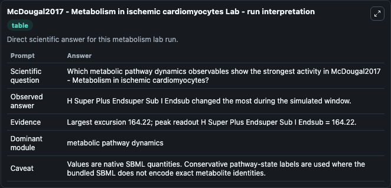
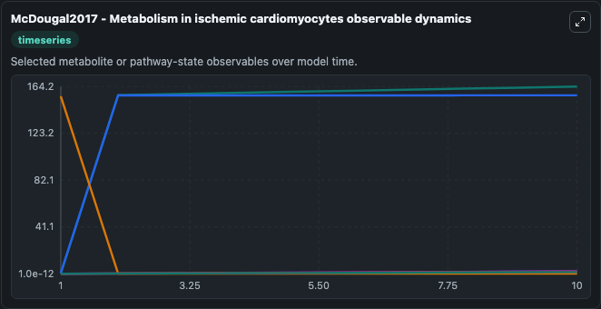
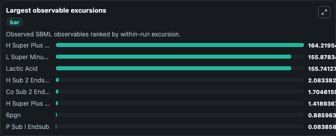
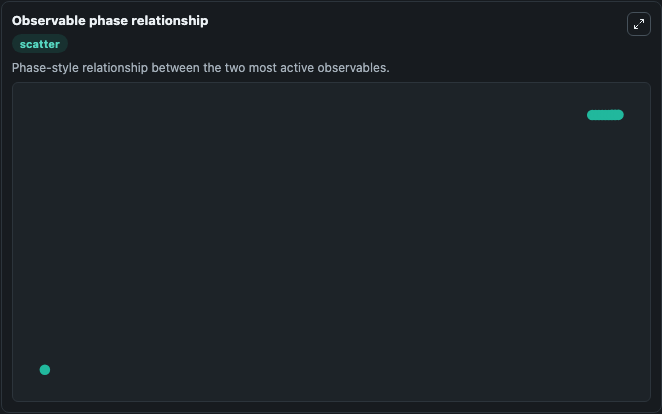

# McDougal2017 - Metabolism in ischemic cardiomyocytes

Cleaned metabolism SBML ODE lab. The bundled SBML file remains the scientific source of truth.

Validation evidence: Tellurium loaded and simulated 42 floating species

## What You'll See

These dark-mode screenshots show the default McDougal2017 - Metabolism in ischemic cardiomyocytes run over 10 model-time units with outputs sampled every 1. The lab exposes 5 inputs (`initial_h_super_plus_endsuper_sub_i_endsub`, `initial_h_super_plus_endsuper_sub_o_endsub`, `initial_oh_super_minus_endsuper_sub_i_endsub`, `initial_oh_super_minus_endsuper_sub_o_endsub`, `initial_na_super_plus_endsuper_sub_i_endsub`) and 8 outputs (`h_super_plus_endsuper_sub_i_endsub`, `h_super_plus_endsuper_sub_o_endsub`, `oh_super_minus_endsuper_sub_i_endsub`, `oh_super_minus_endsuper_sub_o_endsub`, `na_super_plus_endsuper_sub_i_endsub`, and 3 more). The default input state includes `initial_h_super_plus_endsuper_sub_i_endsub`=`0.0000794`, `initial_h_super_plus_endsuper_sub_o_endsub`=`1e-12`, `initial_oh_super_minus_endsuper_sub_i_endsub`=`1e-12`, `initial_oh_super_minus_endsuper_sub_o_endsub`=`1e-12`. Heart disease remains the leading cause of death globally. Although reperfusion following myocardial ischemia can prevent death by restoring nutrient flow, ischemia/reperfusion injury can cause signif.

<!-- BIOSIMULANT_VISUALS_START -->
### Output Visualizations

The run interpretation table summarizes the configured McDougal2017 - Metabolism in ischemic cardiomyocytes simulation and its reported output statistics.

The observable dynamics plot traces the main reported outputs over the captured run window, including `h_super_plus_endsuper_sub_i_endsub`, `h_super_plus_endsuper_sub_o_endsub`, `oh_super_minus_endsuper_sub_i_endsub`, `oh_super_minus_endsuper_sub_o_endsub`, and 4 more.

The largest-observable-excursions chart ranks which reported variables moved the most during this simulation.

The phase-relationship plot compares paired observable values to show how the dominant trajectories move relative to one another.

<!-- BIOSIMULANT_VISUALS_END -->
