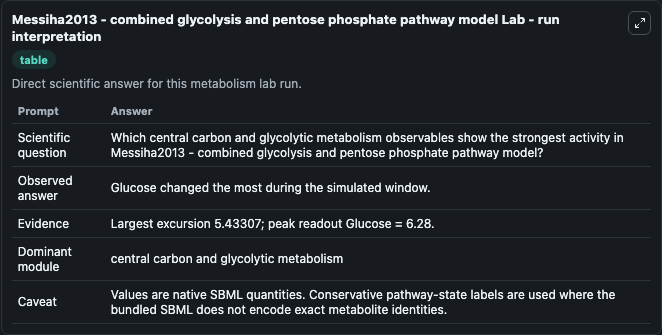
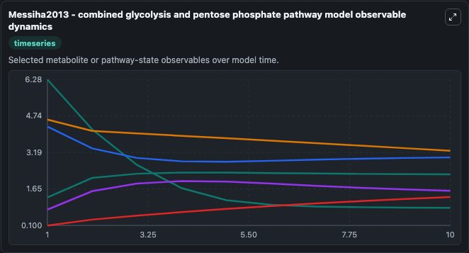
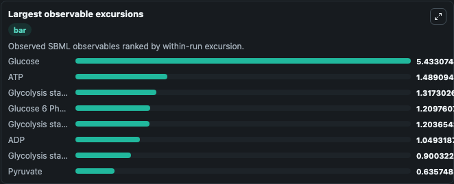
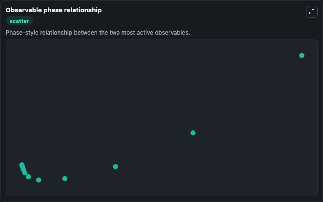

# Messiha2013 - combined glycolysis and pentose phosphate pathway model

Cleaned metabolism SBML ODE lab. The bundled SBML file remains the scientific source of truth.

Validation evidence: Tellurium loaded and simulated 28 floating species

## What You'll See

These dark-mode screenshots show the default Messiha2013 - combined glycolysis and pentose phosphate pathway model run over 10 model-time units with outputs sampled every 1. The lab exposes 5 inputs (`initial_adp`, `initial_atp`, `initial_glycolysis_state_3`, `initial_glycolysis_state_4`, `initial_glycolysis_state_5`) and 8 outputs (`adp`, `atp`, `glycolysis_state_3`, `glycolysis_state_4`, `glycolysis_state_5`, and 3 more). The default input state includes `initial_adp`=`1.29`, `initial_atp`=`4.29`, `initial_glycolysis_state_3`=`0.178140579850657`, `initial_glycolysis_state_4`=`0.000736873499865602`. Messiha2013 - combined glycolysis and pentose phosphate pathway model BIOMD0000000502 and MODEL1303260018 are combined to examine the response to oxidative stress. It can be used to explore metabolic flux dynamics and compare pathway behavior across conditions.

<!-- BIOSIMULANT_VISUALS_START -->
### Output Visualizations

The run interpretation table summarizes the configured Messiha2013 - combined glycolysis and pentose phosphate pathway model simulation and its reported output statistics.

The observable dynamics plot traces the main reported outputs over the captured run window, including `adp`, `atp`, `glycolysis_state_3`, `glycolysis_state_4`, and 4 more.

The largest-observable-excursions chart ranks which reported variables moved the most during this simulation.

The phase-relationship plot compares paired observable values to show how the dominant trajectories move relative to one another.

<!-- BIOSIMULANT_VISUALS_END -->
