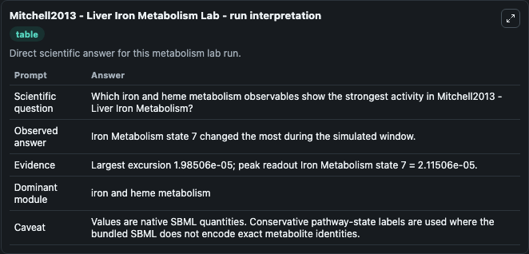
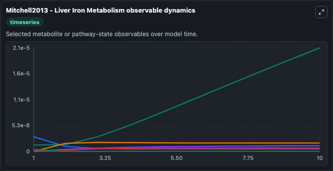
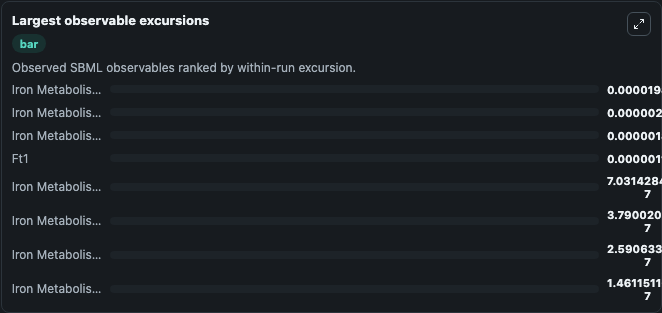
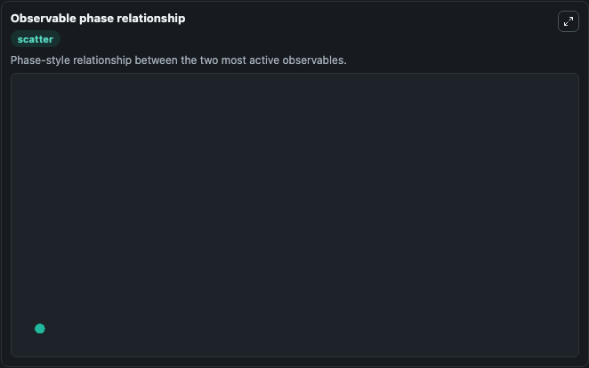

# Mitchell2013 - Liver Iron Metabolism

Cleaned metabolism SBML ODE lab. The bundled SBML file remains the scientific source of truth.

Validation evidence: Tellurium loaded and simulated 19 floating species

## What You'll See

These dark-mode screenshots show the default Mitchell2013 - Liver Iron Metabolism run over 10 model-time units with outputs sampled every 1. The lab exposes 5 inputs (`initial_iron_metabolism_state_1`, `initial_iron_metabolism_state_2`, `initial_ferritin`, `initial_ft1`, `initial_iron_metabolism_state_5`) and 8 outputs (`iron_metabolism_state_1`, `iron_metabolism_state_2`, `ferritin`, `ft1`, `iron_metabolism_state_5`, and 3 more). The default input state includes `initial_iron_metabolism_state_1`=`5e-9`, `initial_iron_metabolism_state_2`=`0`, `initial_ferritin`=`1.66e-10`, `initial_ft1`=`0`. Mitchell2013 - Liver Iron Metabolism The model includes the core regulatory components of human liver iron metabolism. This model is described in the article: A computational model of liver iron metab.

<!-- BIOSIMULANT_VISUALS_START -->
### Output Visualizations

The run interpretation table summarizes the configured Mitchell2013 - Liver Iron Metabolism simulation and its reported output statistics.

The observable dynamics plot traces the main reported outputs over the captured run window, including `iron_metabolism_state_1`, `iron_metabolism_state_2`, `ferritin`, `ft1`, and 4 more.

The largest-observable-excursions chart ranks which reported variables moved the most during this simulation.

The phase-relationship plot compares paired observable values to show how the dominant trajectories move relative to one another.

<!-- BIOSIMULANT_VISUALS_END -->
