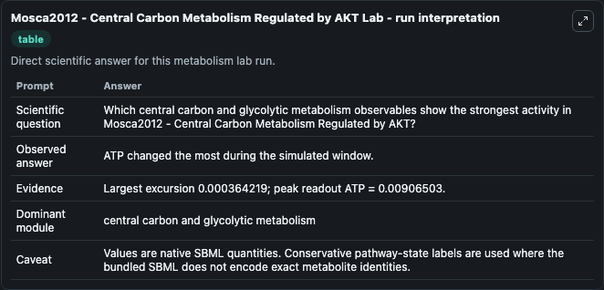
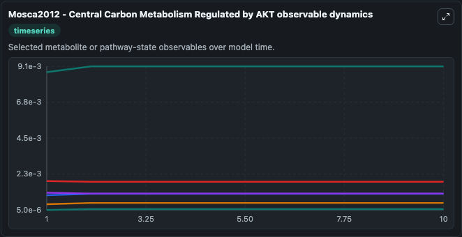
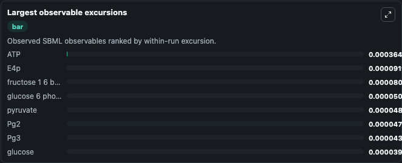
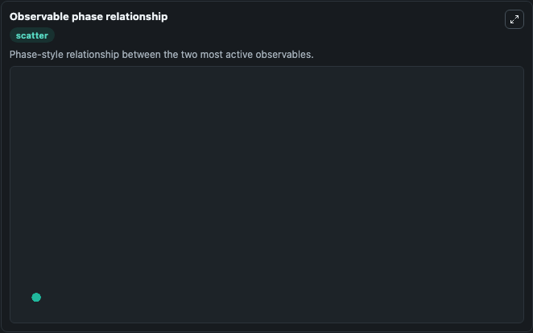

# Mosca2012 - Central Carbon Metabolism Regulated by AKT

Cleaned metabolism SBML ODE lab. The bundled SBML file remains the scientific source of truth.

Validation evidence: Tellurium loaded and simulated 21 floating species

## What You'll See

These dark-mode screenshots show the default Mosca2012 - Central Carbon Metabolism Regulated by AKT run over 10 model-time units with outputs sampled every 1. The lab exposes 5 inputs (`initial_glucose`, `initial_glucose_6_phosphate`, `initial_atp`, `initial_fructose_6_phosphate`, `initial_fructose_1_6_bisphosphate`) and 8 outputs (`glucose`, `glucose_6_phosphate`, `atp`, `fructose_6_phosphate`, `fructose_1_6_bisphosphate`, and 3 more). The default input state includes `initial_glucose`=`0.000897`, `initial_glucose_6_phosphate`=`0.00109`, `initial_atp`=`0.0087`, `initial_fructose_6_phosphate`=`0.0000362`. Mosca2012 - Central Carbon Metabolism Regulated by AKT The role of the PI3K/Akt/PKB signalling pathway in oncogenesis has been extensively investigated and altered expression or mutations of many comp. It can be used to explore metabolic flux dynamics and compare pathway behavior across conditions.

<!-- BIOSIMULANT_VISUALS_START -->
### Output Visualizations

The run interpretation table summarizes the configured Mosca2012 - Central Carbon Metabolism Regulated by AKT simulation and its reported output statistics.

The observable dynamics plot traces the main reported outputs over the captured run window, including `glucose`, `glucose_6_phosphate`, `atp`, `fructose_6_phosphate`, and 4 more.

The largest-observable-excursions chart ranks which reported variables moved the most during this simulation.

The phase-relationship plot compares paired observable values to show how the dominant trajectories move relative to one another.

<!-- BIOSIMULANT_VISUALS_END -->
