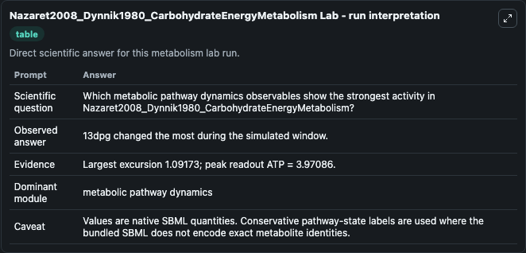
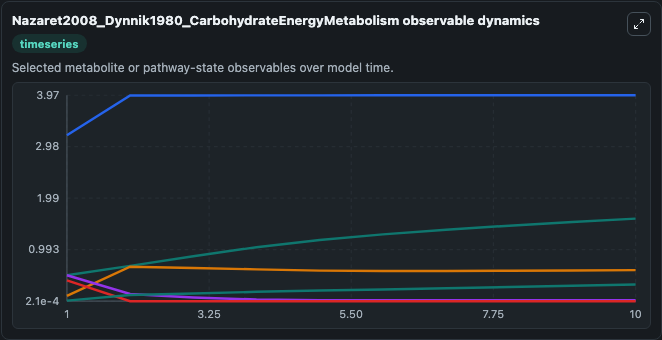
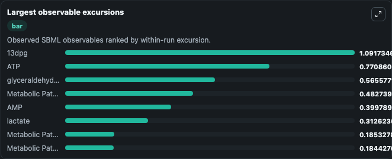
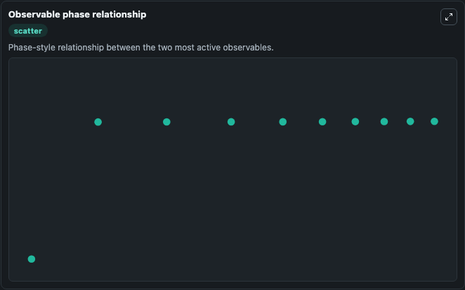

# Nazaret2008_Dynnik1980_CarbohydrateEnergyMetabolism

Cleaned metabolism SBML ODE lab. The bundled SBML file remains the scientific source of truth.

Validation evidence: Tellurium loaded and simulated 12 floating species

## What You'll See

These dark-mode screenshots show the default Nazaret2008_Dynnik1980_CarbohydrateEnergyMetabolism run over 10 model-time units with outputs sampled every 1. The lab exposes 5 inputs (`initial_glyceraldehyde_3_phosphate`, `initial_metabolic_pathway_state_2`, `initial_observable_13dpg`, `initial_pyruvate`, `initial_lactate`) and 8 outputs (`glyceraldehyde_3_phosphate`, `metabolic_pathway_state_2`, `observable_13dpg`, `pyruvate`, `lactate`, and 3 more). The default input state includes `initial_glyceraldehyde_3_phosphate`=`0.1`, `initial_metabolic_pathway_state_2`=`0.5`, `initial_observable_13dpg`=`0.5`, `initial_pyruvate`=`0.01`. This model is from the article: An old paper revisited: ‘‘A mathematical model of carbohydrate energy metabolism. Interaction between glycolysis, the Krebs cycle and the H-transporting shuttles at var.

<!-- BIOSIMULANT_VISUALS_START -->
### Output Visualizations

The run interpretation table summarizes the configured Nazaret2008_Dynnik1980_CarbohydrateEnergyMetabolism simulation and its reported output statistics.

The observable dynamics plot traces the main reported outputs over the captured run window, including `glyceraldehyde_3_phosphate`, `metabolic_pathway_state_2`, `observable_13dpg`, `pyruvate`, and 4 more.

The largest-observable-excursions chart ranks which reported variables moved the most during this simulation.

The phase-relationship plot compares paired observable values to show how the dominant trajectories move relative to one another.

<!-- BIOSIMULANT_VISUALS_END -->
