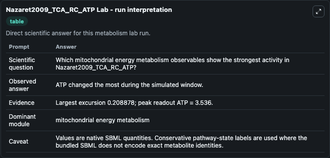
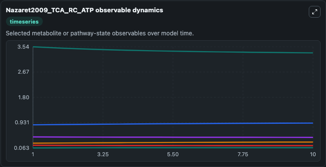
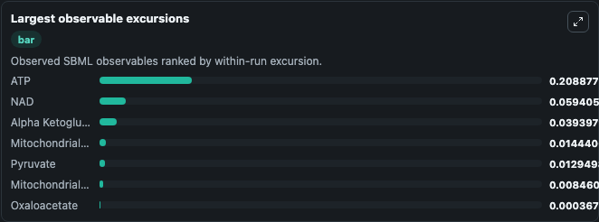
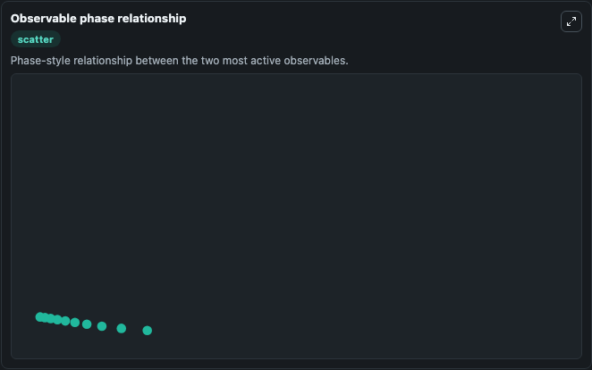

# Nazaret2009_TCA_RC_ATP

Cleaned metabolism SBML ODE lab. The bundled SBML file remains the scientific source of truth.

Validation evidence: Tellurium loaded and simulated 7 floating species

## What You'll See

These dark-mode screenshots show the default Nazaret2009_TCA_RC_ATP run over 10 model-time units with outputs sampled every 1. The lab exposes 5 inputs (`initial_atp`, `initial_nad`, `initial_mitochondrial_energy_state_3`, `initial_alpha_ketoglutarate`, `initial_mitochondrial_energy_state_5`) and 8 outputs (`atp`, `nad`, `mitochondrial_energy_state_3`, `alpha_ketoglutarate`, `mitochondrial_energy_state_5`, and 3 more). The default input state includes `initial_atp`=`3.536`, `initial_nad`=`0.856`, `initial_mitochondrial_energy_state_3`=`0.063`, `initial_alpha_ketoglutarate`=`0.225`. This a model from the article: Mitochondrial energetic metabolism: a simplified model of TCA cycle with ATP production. Nazaret C, Heiske M, Thurley K, Mazat JP J.

<!-- BIOSIMULANT_VISUALS_START -->
### Output Visualizations

The run interpretation table summarizes the configured Nazaret2009_TCA_RC_ATP simulation and its reported output statistics.

The observable dynamics plot traces the main reported outputs over the captured run window, including `atp`, `nad`, `mitochondrial_energy_state_3`, `alpha_ketoglutarate`, and 4 more.

The largest-observable-excursions chart ranks which reported variables moved the most during this simulation.

The phase-relationship plot compares paired observable values to show how the dominant trajectories move relative to one another.

<!-- BIOSIMULANT_VISUALS_END -->
