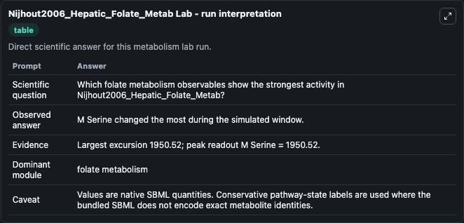
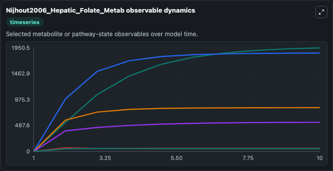
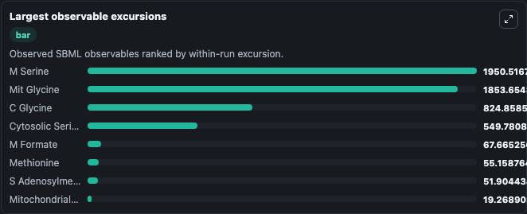
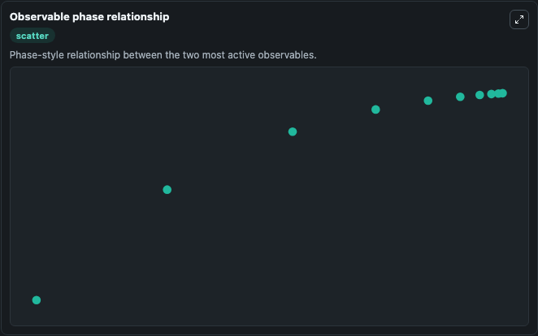

# Nijhout2006_Hepatic_Folate_Metab

Cleaned metabolism SBML ODE lab. The bundled SBML file remains the scientific source of truth.

Validation evidence: Tellurium loaded and simulated 23 floating species

## What You'll See

These dark-mode screenshots show the default Nijhout2006_Hepatic_Folate_Metab run over 10 model-time units with outputs sampled every 1. The lab exposes 5 inputs (`initial_cytosolic_tetrahydrofolate`, `initial_mitochondrial_tetrahydrofolate`, `initial_folate_metabolism_state_3`, `initial_folate_metabolism_state_4`, `initial_folate_metabolism_state_5`) and 8 outputs (`cytosolic_tetrahydrofolate`, `mitochondrial_tetrahydrofolate`, `folate_metabolism_state_3`, `folate_metabolism_state_4`, `folate_metabolism_state_5`, and 3 more). The default input state includes `initial_cytosolic_tetrahydrofolate`=`13.333333333333334`, `initial_mitochondrial_tetrahydrofolate`=`40`, `initial_folate_metabolism_state_3`=`0`, `initial_folate_metabolism_state_4`=`0`. This is the model described in the article: In silico experimentation with a model of hepatic mitochondrial folate metabolism. It can be used to explore metabolic flux dynamics and compare pathway behavior across conditions.

<!-- BIOSIMULANT_VISUALS_START -->
### Output Visualizations

The run interpretation table summarizes the configured Nijhout2006_Hepatic_Folate_Metab simulation and its reported output statistics.

The observable dynamics plot traces the main reported outputs over the captured run window, including `cytosolic_tetrahydrofolate`, `mitochondrial_tetrahydrofolate`, `folate_metabolism_state_3`, `folate_metabolism_state_4`, and 4 more.

The largest-observable-excursions chart ranks which reported variables moved the most during this simulation.

The phase-relationship plot compares paired observable values to show how the dominant trajectories move relative to one another.

<!-- BIOSIMULANT_VISUALS_END -->
