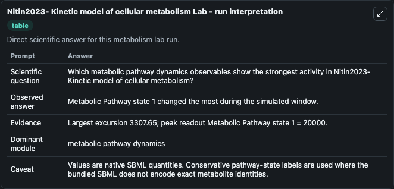
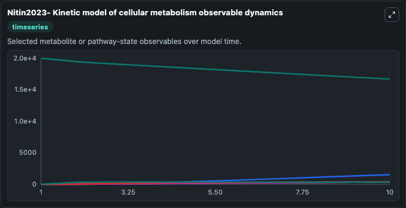
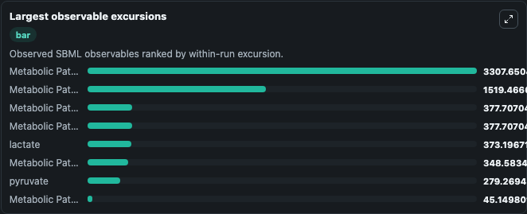
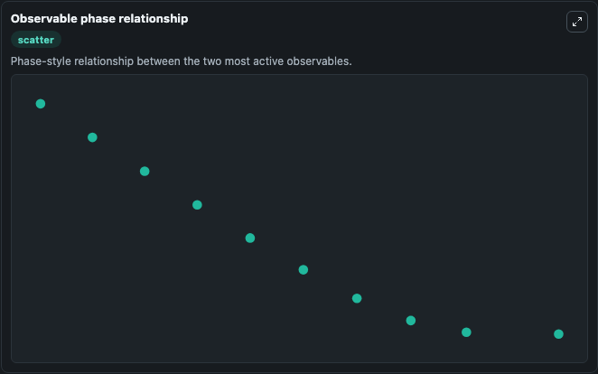

# Nitin2023- Kinetic model of cellular metabolism

Cleaned metabolism SBML ODE lab. The bundled SBML file remains the scientific source of truth.

Validation evidence: Tellurium loaded and simulated 10 floating species

## What You'll See

These dark-mode screenshots show the default Nitin2023- Kinetic model of cellular metabolism run over 10 model-time units with outputs sampled every 1. The lab exposes 5 inputs (`initial_metabolic_pathway_state_1`, `initial_metabolic_pathway_state_2`, `initial_metabolic_pathway_state_3`, `initial_observable_2dg`, `initial_metabolic_pathway_state_5`) and 8 outputs (`metabolic_pathway_state_1`, `metabolic_pathway_state_2`, `metabolic_pathway_state_3`, `observable_2dg`, `metabolic_pathway_state_5`, and 3 more). The default input state includes `initial_metabolic_pathway_state_1`=`20000`, `initial_metabolic_pathway_state_2`=`0`, `initial_metabolic_pathway_state_3`=`0`, `initial_observable_2dg`=`0`. A simplistic numerical model designed to simulate and augment the commercially available real-time, in-vitro, end-point kinetic glycolysis assay with and without pathway-modulating drugs to extend the. It can be used to explore metabolic flux dynamics and compare pathway behavior across conditions.

<!-- BIOSIMULANT_VISUALS_START -->
### Output Visualizations

The run interpretation table summarizes the configured Nitin2023- Kinetic model of cellular metabolism simulation and its reported output statistics.

The observable dynamics plot traces the main reported outputs over the captured run window, including `metabolic_pathway_state_1`, `metabolic_pathway_state_2`, `metabolic_pathway_state_3`, `observable_2dg`, and 4 more.

The largest-observable-excursions chart ranks which reported variables moved the most during this simulation.

The phase-relationship plot compares paired observable values to show how the dominant trajectories move relative to one another.

<!-- BIOSIMULANT_VISUALS_END -->
