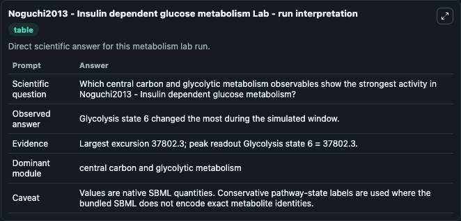
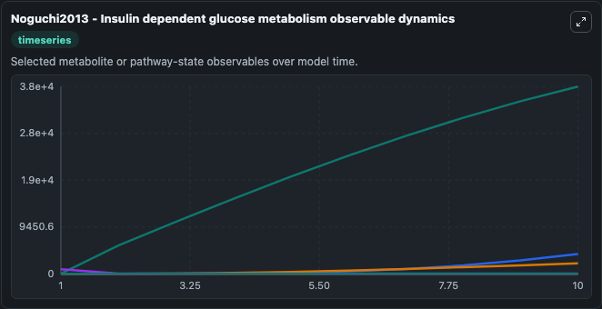
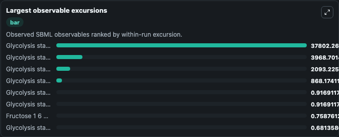
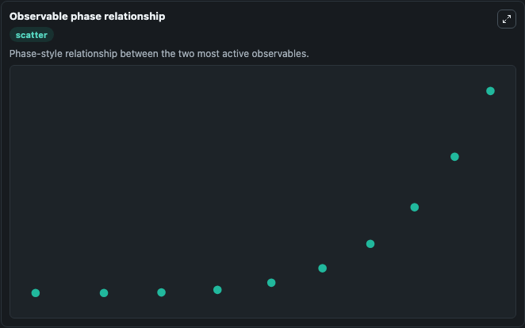

# Noguchi2013 - Insulin dependent glucose metabolism

Cleaned metabolism SBML ODE lab. The bundled SBML file remains the scientific source of truth.

Validation evidence: Tellurium loaded and simulated 23 floating species

## What You'll See

These dark-mode screenshots show the default Noguchi2013 - Insulin dependent glucose metabolism run over 10 model-time units with outputs sampled every 1. The lab exposes 5 inputs (`initial_glycolysis_state_1`, `initial_glycolysis_state_2`, `initial_mitochondrial_rna`, `initial_glycolysis_state_4`, `initial_glycolysis_state_5`) and 8 outputs (`glycolysis_state_1`, `glycolysis_state_2`, `mitochondrial_rna`, `glycolysis_state_4`, `glycolysis_state_5`, and 3 more). The default input state includes `initial_glycolysis_state_1`=`0.4726`, `initial_glycolysis_state_2`=`0.1723`, `initial_mitochondrial_rna`=`2.905`, `initial_glycolysis_state_4`=`0.7686`. Rei Noguchi, Hiroyuki Kubota, Katsuyuki Yugi, Yu Toyoshima, Yasunori Komori, Tomoyoshi Soga & Shinya Kuroda. The selective control of glycolysis, gluconeogenesis and glycogenesis by temporal insulin p.

<!-- BIOSIMULANT_VISUALS_START -->
### Output Visualizations

The run interpretation table summarizes the configured Noguchi2013 - Insulin dependent glucose metabolism simulation and its reported output statistics.

The observable dynamics plot traces the main reported outputs over the captured run window, including `glycolysis_state_1`, `glycolysis_state_2`, `mitochondrial_rna`, `glycolysis_state_4`, and 4 more.

The largest-observable-excursions chart ranks which reported variables moved the most during this simulation.

The phase-relationship plot compares paired observable values to show how the dominant trajectories move relative to one another.

<!-- BIOSIMULANT_VISUALS_END -->
