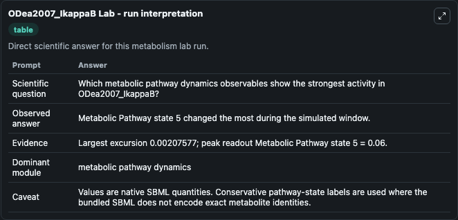
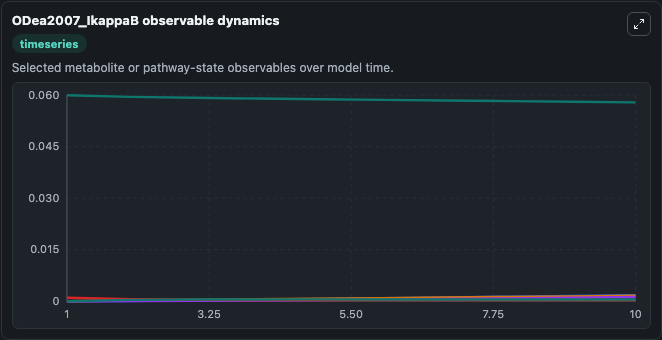
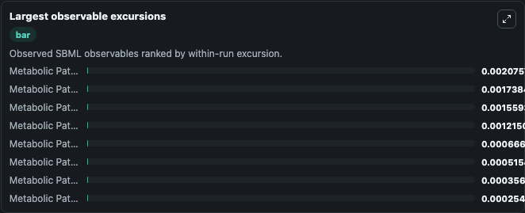
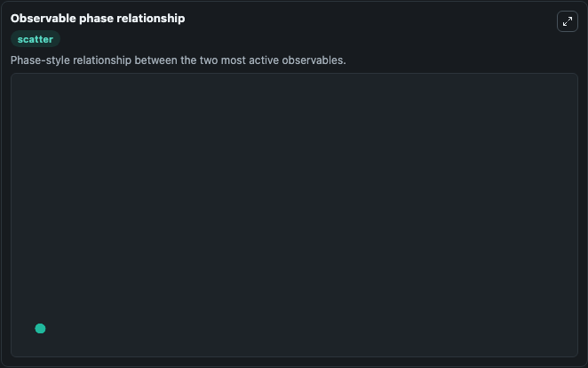

# ODea2007_IkappaB

Cleaned metabolism SBML ODE lab. The bundled SBML file remains the scientific source of truth.

Validation evidence: Tellurium loaded and simulated 24 floating species

## What You'll See

These dark-mode screenshots show the default ODea2007_IkappaB run over 10 model-time units with outputs sampled every 1. The lab exposes 5 inputs (`initial_metabolic_pathway_state_1`, `initial_metabolic_pathway_state_2`, `initial_metabolic_pathway_state_3`, `initial_metabolic_pathway_state_4`, `initial_metabolic_pathway_state_5`) and 8 outputs (`metabolic_pathway_state_1`, `metabolic_pathway_state_2`, `metabolic_pathway_state_3`, `metabolic_pathway_state_4`, `metabolic_pathway_state_5`, and 3 more). The default input state includes `initial_metabolic_pathway_state_1`=`0`, `initial_metabolic_pathway_state_2`=`0`, `initial_metabolic_pathway_state_3`=`0`, `initial_metabolic_pathway_state_4`=`0`. O'Dea, E.L., Barken, D., Peralta, R.Q., Tran K.T., Werner, S.L., Kearns, J.D., Levchenko, A., Hoffmann, A. A homeostatic model of IkB metabolism to control constitutive activity.

<!-- BIOSIMULANT_VISUALS_START -->
### Output Visualizations

The run interpretation table summarizes the configured ODea2007_IkappaB simulation and its reported output statistics.

The observable dynamics plot traces the main reported outputs over the captured run window, including `metabolic_pathway_state_1`, `metabolic_pathway_state_2`, `metabolic_pathway_state_3`, `metabolic_pathway_state_4`, and 4 more.

The largest-observable-excursions chart ranks which reported variables moved the most during this simulation.

The phase-relationship plot compares paired observable values to show how the dominant trajectories move relative to one another.

<!-- BIOSIMULANT_VISUALS_END -->
