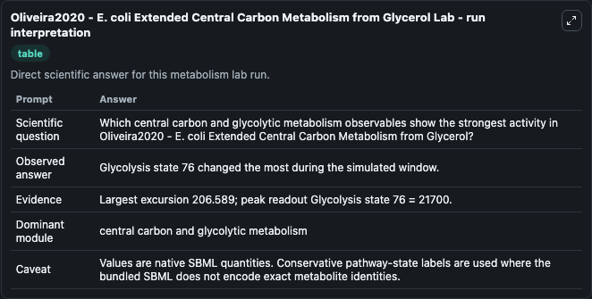
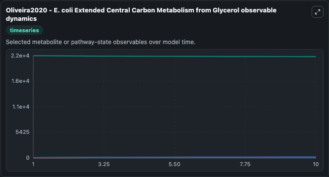
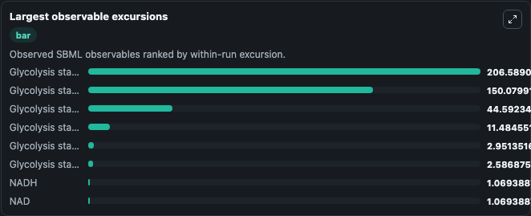
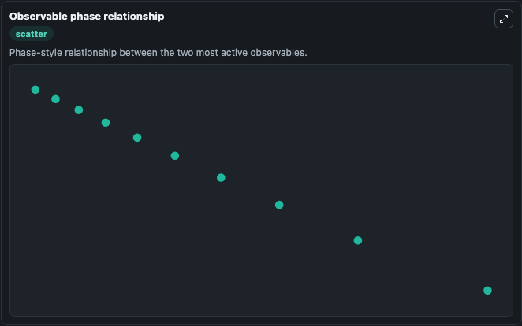

# Oliveira2020 - E. coli Extended Central Carbon Metabolism from Glycerol

Cleaned metabolism SBML ODE lab. The bundled SBML file remains the scientific source of truth.

Validation evidence: Tellurium loaded and simulated 77 floating species

## What You'll See

These dark-mode screenshots show the default Oliveira2020 - E. coli Extended Central Carbon Metabolism from Glycerol run over 10 model-time units with outputs sampled every 1. The lab exposes 5 inputs (`initial_glycolysis_state_1`, `initial_glycolysis_state_2`, `initial_glycolysis_state_3`, `initial_glycolysis_state_4`, `initial_glycolysis_state_5`) and 8 outputs (`glycolysis_state_1`, `glycolysis_state_2`, `glycolysis_state_3`, `glycolysis_state_4`, `glycolysis_state_5`, and 3 more). The default input state includes `initial_glycolysis_state_1`=`0.142215148385023`, `initial_glycolysis_state_2`=`0.0460024355785109`, `initial_glycolysis_state_3`=`0.0282547194235527`, `initial_glycolysis_state_4`=`0.309617017238334`. The kinetic model of E. coli central carbon metabolism developed by Millard et al.

<!-- BIOSIMULANT_VISUALS_START -->
### Output Visualizations

The run interpretation table summarizes the configured Oliveira2020 - E. coli Extended Central Carbon Metabolism from Glycerol simulation and its reported output statistics.

The observable dynamics plot traces the main reported outputs over the captured run window, including `glycolysis_state_1`, `glycolysis_state_2`, `glycolysis_state_3`, `glycolysis_state_4`, and 4 more.

The largest-observable-excursions chart ranks which reported variables moved the most during this simulation.

The phase-relationship plot compares paired observable values to show how the dominant trajectories move relative to one another.

<!-- BIOSIMULANT_VISUALS_END -->
